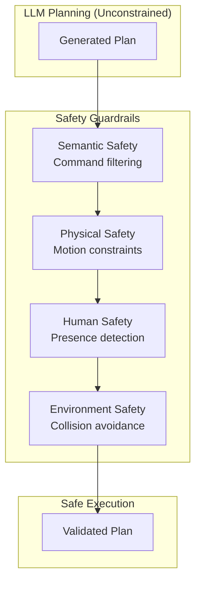
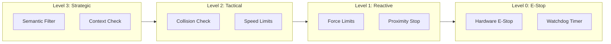
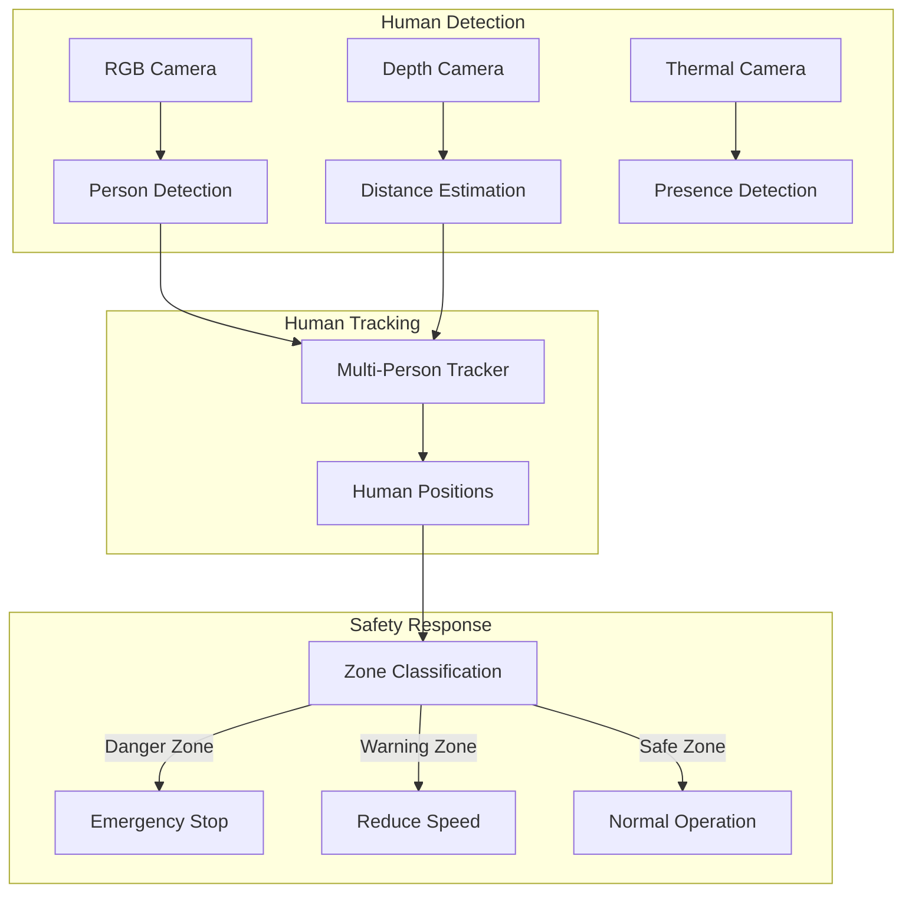

# Chapter 6: Safety Guardrails for VLA Systems

:::note Learning Objectives
By the end of this chapter, you will be able to:
- Design a multi-layered safety architecture for VLA systems
- Implement physical safety constraints for manipulation and navigation
- Build human safety detection and response systems
- Create semantic safety filters for LLM-generated plans
- Implement emergency stop and safe state recovery
- Integrate safety monitoring with ROS 2
:::

## The Critical Importance of Safety

When an LLM plans robot actions, there is no inherent guarantee those actions are safe. A model might generate a plan to "pick up the knife quickly" without considering who might be nearby. Safety guardrails are the critical layer between LLM reasoning and physical action.



## Safety Architecture Overview

### Safety Levels

| Level | Response Time | Purpose | Examples |
|-------|--------------|---------|----------|
| **Level 0: E-Stop** | < 10ms | Immediate halt | Hardware emergency stop |
| **Level 1: Reactive** | < 100ms | Real-time collision avoidance | Force sensors, proximity |
| **Level 2: Tactical** | < 1s | Plan modification | Obstacle detection |
| **Level 3: Strategic** | < 5s | Plan rejection/replanning | Semantic safety |



## Semantic Safety Layer

The semantic layer filters plans before any physical execution:

```python
from dataclasses import dataclass
from typing import List, Dict, Any, Optional, Tuple
from enum import Enum
import re

class SafetyViolationType(Enum):
    """Types of safety violations"""
    HARMFUL_ACTION = "harmful_action"
    DANGEROUS_OBJECT = "dangerous_object"
    FORBIDDEN_ZONE = "forbidden_zone"
    HUMAN_RISK = "human_risk"
    PROPERTY_RISK = "property_risk"
    UNAUTHORIZED_ACTION = "unauthorized_action"


@dataclass
class SafetyViolation:
    """Represents a detected safety violation"""
    violation_type: SafetyViolationType
    severity: str  # 'low', 'medium', 'high', 'critical'
    description: str
    affected_step_id: Optional[int]
    mitigation: str


class SemanticSafetyFilter:
    """
    Filters LLM-generated plans for semantic safety violations

    Checks for:
    - Harmful actions or intents
    - Dangerous object handling
    - Unauthorized access/actions
    - Commands that could harm humans
    """

    def __init__(self):
        # Dangerous object categories
        self.dangerous_objects = {
            'sharp': ['knife', 'scissors', 'blade', 'razor', 'needle'],
            'hot': ['stove', 'oven', 'iron', 'candle', 'hot plate'],
            'chemical': ['bleach', 'ammonia', 'acid', 'solvent'],
            'electrical': ['exposed wire', 'outlet', 'live wire'],
            'fragile': ['glass', 'crystal', 'ceramic', 'mirror']
        }

        # Forbidden actions
        self.forbidden_actions = [
            r'throw.*at.*person',
            r'hit\s+(?:human|person|user)',
            r'push.*(?:person|human)',
            r'lock.*(?:person|human)',
            r'trap\s+',
            r'harm\s+',
            r'hurt\s+',
            r'attack\s+'
        ]

        # Compile patterns
        self.forbidden_patterns = [
            re.compile(pattern, re.IGNORECASE)
            for pattern in self.forbidden_actions
        ]

        # Restricted zones
        self.restricted_zones = [
            'electrical panel',
            'gas valve',
            'emergency exit',
            'fire extinguisher',
            'medicine cabinet'
        ]

    def check_plan(self, plan: 'TaskPlan') -> List[SafetyViolation]:
        """
        Check plan for semantic safety violations

        Returns list of violations found
        """
        violations = []

        # Check overall task description
        violations.extend(self._check_task_intent(plan.task_summary))

        # Check each step
        for step in plan.steps:
            violations.extend(self._check_step(step))

        return violations

    def _check_task_intent(self, task_summary: str) -> List[SafetyViolation]:
        """Check if the overall task intent is safe"""
        violations = []

        for pattern in self.forbidden_patterns:
            if pattern.search(task_summary):
                violations.append(SafetyViolation(
                    violation_type=SafetyViolationType.HARMFUL_ACTION,
                    severity='critical',
                    description=f"Task intent contains forbidden action pattern",
                    affected_step_id=None,
                    mitigation="Reject task entirely"
                ))

        return violations

    def _check_step(self, step: 'PlanStep') -> List[SafetyViolation]:
        """Check individual step for safety violations"""
        violations = []

        # Check for dangerous objects
        if step.action in ['grasp', 'pick', 'manipulate']:
            target = step.parameters.get('object', '')
            for category, objects in self.dangerous_objects.items():
                for obj in objects:
                    if obj in target.lower():
                        severity = 'high' if category in ['sharp', 'chemical'] else 'medium'
                        violations.append(SafetyViolation(
                            violation_type=SafetyViolationType.DANGEROUS_OBJECT,
                            severity=severity,
                            description=f"Handling {category} object: {obj}",
                            affected_step_id=step.id,
                            mitigation=f"Apply {category} handling protocol"
                        ))

        # Check for forbidden zones
        if step.action in ['navigate_to', 'approach']:
            location = step.parameters.get('location', '')
            for zone in self.restricted_zones:
                if zone in location.lower():
                    violations.append(SafetyViolation(
                        violation_type=SafetyViolationType.FORBIDDEN_ZONE,
                        severity='high',
                        description=f"Attempting to access restricted zone: {zone}",
                        affected_step_id=step.id,
                        mitigation="Require explicit authorization"
                    ))

        # Check step description for dangerous patterns
        for pattern in self.forbidden_patterns:
            if pattern.search(step.description):
                violations.append(SafetyViolation(
                    violation_type=SafetyViolationType.HARMFUL_ACTION,
                    severity='critical',
                    description=f"Step description contains forbidden action",
                    affected_step_id=step.id,
                    mitigation="Remove or modify step"
                ))

        return violations
```

## LLM-Based Safety Validation

Use a separate LLM call to validate plans:

```python
class LLMSafetyValidator:
    """
    Uses LLM to validate plan safety
    Provides more nuanced safety checking than rule-based approaches
    """

    SAFETY_VALIDATION_PROMPT = """
You are a safety validator for a humanoid robot. Your job is to identify
potential safety issues in robot action plans.

Review this plan and identify any safety concerns:

## Plan
Task: {task_summary}
Steps:
{steps}

## Safety Categories to Check

1. **Human Safety**: Could any step harm a human?
2. **Property Safety**: Could any step damage property?
3. **Robot Safety**: Could any step damage the robot?
4. **Privacy**: Does the plan violate privacy?
5. **Authorization**: Does the plan require special permissions?

## Response Format

Return JSON:
{{
    "is_safe": true/false,
    "overall_risk": "low/medium/high/critical",
    "concerns": [
        {{
            "step_id": 1,
            "concern": "description",
            "severity": "low/medium/high/critical",
            "recommendation": "how to mitigate"
        }}
    ],
    "approval_required": true/false,
    "approval_reason": "why approval needed"
}}

Be thorough but not paranoid. Normal household tasks are generally safe.
Focus on actual risks, not theoretical edge cases.
"""

    def __init__(self, llm_client):
        self.client = llm_client

    async def validate(self, plan: 'TaskPlan') -> Dict[str, Any]:
        """Validate plan using LLM"""
        steps_text = "\n".join([
            f"{s.id}. {s.action}({s.parameters}): {s.description}"
            for s in plan.steps
        ])

        prompt = self.SAFETY_VALIDATION_PROMPT.format(
            task_summary=plan.task_summary,
            steps=steps_text
        )

        response = await self.client.chat.completions.create(
            model="gpt-4-turbo-preview",
            messages=[
                {"role": "system", "content": "You are a robot safety validator."},
                {"role": "user", "content": prompt}
            ],
            response_format={"type": "json_object"}
        )

        return json.loads(response.choices[0].message.content)
```

## Physical Safety Constraints

Physical safety operates at the motion control level:

```python
from dataclasses import dataclass
import numpy as np

@dataclass
class PhysicalLimits:
    """Physical safety limits for robot motion"""
    max_velocity: float = 0.5  # m/s for end effector
    max_acceleration: float = 1.0  # m/s^2
    max_force: float = 50.0  # N for manipulation
    max_torque: float = 20.0  # Nm for joints
    min_distance_to_human: float = 0.5  # m
    max_reach_height: float = 2.0  # m
    min_reach_height: float = 0.1  # m


class PhysicalSafetyMonitor:
    """
    Real-time physical safety monitoring

    Monitors:
    - Joint velocities and accelerations
    - End effector forces
    - Distance to obstacles and humans
    - Workspace boundaries
    """

    def __init__(self, limits: PhysicalLimits = None):
        self.limits = limits or PhysicalLimits()
        self.violation_callbacks = []

    def register_violation_callback(self, callback):
        """Register callback for safety violations"""
        self.violation_callbacks.append(callback)

    def check_velocity(self, velocity: np.ndarray) -> Tuple[bool, str]:
        """Check if velocity is within limits"""
        speed = np.linalg.norm(velocity)
        if speed > self.limits.max_velocity:
            return False, f"Velocity {speed:.2f} exceeds limit {self.limits.max_velocity}"
        return True, ""

    def check_force(self, force: np.ndarray) -> Tuple[bool, str]:
        """Check if force is within limits"""
        magnitude = np.linalg.norm(force)
        if magnitude > self.limits.max_force:
            return False, f"Force {magnitude:.2f}N exceeds limit {self.limits.max_force}N"
        return True, ""

    def check_human_distance(
        self,
        robot_position: np.ndarray,
        human_positions: List[np.ndarray]
    ) -> Tuple[bool, str]:
        """Check distance to all detected humans"""
        for i, human_pos in enumerate(human_positions):
            distance = np.linalg.norm(robot_position - human_pos)
            if distance < self.limits.min_distance_to_human:
                return False, f"Too close to human {i}: {distance:.2f}m"
        return True, ""

    def check_workspace(self, position: np.ndarray) -> Tuple[bool, str]:
        """Check if position is within allowed workspace"""
        if position[2] > self.limits.max_reach_height:
            return False, f"Height {position[2]:.2f}m exceeds max {self.limits.max_reach_height}m"
        if position[2] < self.limits.min_reach_height:
            return False, f"Height {position[2]:.2f}m below min {self.limits.min_reach_height}m"
        return True, ""

    def comprehensive_check(
        self,
        robot_state: Dict[str, Any],
        human_positions: List[np.ndarray]
    ) -> Tuple[bool, List[str]]:
        """Run all safety checks"""
        violations = []

        # Check velocity
        safe, msg = self.check_velocity(np.array(robot_state.get('velocity', [0, 0, 0])))
        if not safe:
            violations.append(msg)

        # Check force
        safe, msg = self.check_force(np.array(robot_state.get('force', [0, 0, 0])))
        if not safe:
            violations.append(msg)

        # Check human distance
        safe, msg = self.check_human_distance(
            np.array(robot_state.get('position', [0, 0, 0])),
            human_positions
        )
        if not safe:
            violations.append(msg)

        # Check workspace
        safe, msg = self.check_workspace(np.array(robot_state.get('position', [0, 0, 0])))
        if not safe:
            violations.append(msg)

        if violations:
            for callback in self.violation_callbacks:
                callback(violations)

        return len(violations) == 0, violations
```

## Human Safety System

Human safety requires real-time detection and response:



### Human Safety Monitor Implementation

```python
class HumanSafetyZone(Enum):
    """Safety zones relative to robot"""
    DANGER = "danger"      # < 0.5m - immediate stop
    WARNING = "warning"    # 0.5-1.5m - reduced speed
    CAUTION = "caution"    # 1.5-3.0m - heightened awareness
    SAFE = "safe"          # > 3.0m - normal operation


@dataclass
class HumanTrack:
    """Tracked human information"""
    track_id: int
    position: np.ndarray
    velocity: np.ndarray
    confidence: float
    last_seen: float
    zone: HumanSafetyZone


class HumanSafetyMonitor:
    """
    Monitors human presence and enforces safety zones

    Uses person detection and tracking to maintain awareness
    of all humans in the robot's environment
    """

    def __init__(self):
        self.zone_thresholds = {
            HumanSafetyZone.DANGER: 0.5,
            HumanSafetyZone.WARNING: 1.5,
            HumanSafetyZone.CAUTION: 3.0
        }

        self.tracked_humans: Dict[int, HumanTrack] = {}
        self.safety_callbacks = {
            HumanSafetyZone.DANGER: [],
            HumanSafetyZone.WARNING: [],
            HumanSafetyZone.CAUTION: []
        }

        # Speed reduction factors
        self.speed_factors = {
            HumanSafetyZone.DANGER: 0.0,    # Full stop
            HumanSafetyZone.WARNING: 0.3,   # 30% speed
            HumanSafetyZone.CAUTION: 0.7,   # 70% speed
            HumanSafetyZone.SAFE: 1.0       # Full speed
        }

    def update_humans(
        self,
        detections: List[Dict[str, Any]],
        robot_position: np.ndarray
    ):
        """Update tracked humans from detections"""
        current_time = time.time()

        for detection in detections:
            track_id = detection['track_id']
            position = np.array(detection['position'])

            # Calculate distance to robot
            distance = np.linalg.norm(position - robot_position)

            # Determine zone
            zone = self._classify_zone(distance)

            # Update or create track
            if track_id in self.tracked_humans:
                old_zone = self.tracked_humans[track_id].zone
                self.tracked_humans[track_id].position = position
                self.tracked_humans[track_id].velocity = np.array(detection.get('velocity', [0, 0, 0]))
                self.tracked_humans[track_id].confidence = detection['confidence']
                self.tracked_humans[track_id].last_seen = current_time
                self.tracked_humans[track_id].zone = zone

                # Trigger callbacks on zone transitions
                if zone != old_zone:
                    self._trigger_zone_callbacks(track_id, old_zone, zone)
            else:
                self.tracked_humans[track_id] = HumanTrack(
                    track_id=track_id,
                    position=position,
                    velocity=np.array(detection.get('velocity', [0, 0, 0])),
                    confidence=detection['confidence'],
                    last_seen=current_time,
                    zone=zone
                )

        # Remove stale tracks
        self._prune_stale_tracks(current_time)

    def _classify_zone(self, distance: float) -> HumanSafetyZone:
        """Classify distance into safety zone"""
        if distance < self.zone_thresholds[HumanSafetyZone.DANGER]:
            return HumanSafetyZone.DANGER
        elif distance < self.zone_thresholds[HumanSafetyZone.WARNING]:
            return HumanSafetyZone.WARNING
        elif distance < self.zone_thresholds[HumanSafetyZone.CAUTION]:
            return HumanSafetyZone.CAUTION
        else:
            return HumanSafetyZone.SAFE

    def get_speed_limit(self) -> float:
        """Get current speed limit based on closest human"""
        if not self.tracked_humans:
            return 1.0

        # Find most restrictive zone
        most_restrictive = HumanSafetyZone.SAFE
        for human in self.tracked_humans.values():
            if human.zone.value < most_restrictive.value:
                most_restrictive = human.zone

        return self.speed_factors[most_restrictive]

    def get_closest_human(self) -> Optional[HumanTrack]:
        """Get the closest tracked human"""
        if not self.tracked_humans:
            return None

        return min(
            self.tracked_humans.values(),
            key=lambda h: np.linalg.norm(h.position)
        )

    def predict_collision(
        self,
        robot_trajectory: List[np.ndarray],
        time_horizon: float = 2.0
    ) -> Optional[Tuple[int, float]]:
        """
        Predict if robot trajectory will collide with any human

        Returns: (human_track_id, time_to_collision) or None
        """
        for human in self.tracked_humans.values():
            # Simple linear prediction
            for t_idx, robot_pos in enumerate(robot_trajectory):
                t = t_idx * (time_horizon / len(robot_trajectory))
                predicted_human_pos = human.position + human.velocity * t

                distance = np.linalg.norm(robot_pos - predicted_human_pos)
                if distance < self.zone_thresholds[HumanSafetyZone.DANGER]:
                    return (human.track_id, t)

        return None

    def _trigger_zone_callbacks(
        self,
        track_id: int,
        old_zone: HumanSafetyZone,
        new_zone: HumanSafetyZone
    ):
        """Trigger callbacks for zone transitions"""
        # Only trigger for transitions to more dangerous zones
        if new_zone in self.safety_callbacks:
            for callback in self.safety_callbacks[new_zone]:
                callback(track_id, old_zone, new_zone)

    def _prune_stale_tracks(self, current_time: float, max_age: float = 2.0):
        """Remove tracks that haven't been updated recently"""
        stale_ids = [
            track_id for track_id, track in self.tracked_humans.items()
            if current_time - track.last_seen > max_age
        ]
        for track_id in stale_ids:
            del self.tracked_humans[track_id]
```

## Emergency Stop System

```python
class EmergencyStopSystem:
    """
    Hardware and software emergency stop system

    Implements multiple levels of emergency response
    """

    def __init__(self):
        self.is_estopped = False
        self.estop_reason = ""
        self.estop_callbacks = []

    def register_callback(self, callback):
        """Register emergency stop callback"""
        self.estop_callbacks.append(callback)

    def trigger_estop(self, reason: str, level: str = "software"):
        """
        Trigger emergency stop

        Args:
            reason: Why estop was triggered
            level: 'software' or 'hardware'
        """
        self.is_estopped = True
        self.estop_reason = reason

        # Execute callbacks
        for callback in self.estop_callbacks:
            try:
                callback(reason, level)
            except Exception as e:
                # Log but don't fail on callback errors
                print(f"E-Stop callback error: {e}")

        # If hardware level, send to hardware controller
        if level == "hardware":
            self._hardware_estop()

    def _hardware_estop(self):
        """Send hardware emergency stop signal"""
        # Implementation depends on hardware
        # Typically sends signal to motor controllers
        pass

    def reset(self, authorization_code: str) -> bool:
        """
        Reset emergency stop

        Requires authorization to prevent accidental reset
        """
        if not self._verify_authorization(authorization_code):
            return False

        # Check if safe to reset
        if not self._check_safe_to_reset():
            return False

        self.is_estopped = False
        self.estop_reason = ""
        return True

    def _verify_authorization(self, code: str) -> bool:
        """Verify reset authorization"""
        # In production, this would verify against secure credentials
        return len(code) > 0

    def _check_safe_to_reset(self) -> bool:
        """Check if environment is safe to reset"""
        # Check for clear workspace, etc.
        return True
```

## Integrated Safety Node for ROS 2

```python
#!/usr/bin/env python3
"""
Integrated Safety Monitor Node for ROS 2
"""

import rclpy
from rclpy.node import Node
from std_msgs.msg import Bool, String
from geometry_msgs.msg import PoseArray, TwistStamped
from sensor_msgs.msg import JointState
import json

class SafetyMonitorNode(Node):
    """
    Comprehensive safety monitoring node

    Subscribers:
        /humans/tracked: Tracked human positions
        /robot/state: Robot joint states and velocities
        /planner/plan: Plans to validate

    Publishers:
        /safety/status: Current safety status
        /safety/speed_limit: Current speed limit factor
        /safety/estop: Emergency stop commands
        /safety/violations: Detected violations
    """

    def __init__(self):
        super().__init__('safety_monitor_node')

        # Initialize safety systems
        self.semantic_filter = SemanticSafetyFilter()
        self.physical_monitor = PhysicalSafetyMonitor()
        self.human_monitor = HumanSafetyMonitor()
        self.estop = EmergencyStopSystem()

        # Register estop callback
        self.estop.register_callback(self._on_estop)

        # Subscribers
        self.human_sub = self.create_subscription(
            PoseArray,
            '/humans/tracked',
            self.humans_callback,
            10
        )

        self.state_sub = self.create_subscription(
            JointState,
            '/robot/state',
            self.state_callback,
            10
        )

        self.plan_sub = self.create_subscription(
            String,
            '/planner/plan',
            self.plan_callback,
            10
        )

        # Publishers
        self.status_pub = self.create_publisher(String, '/safety/status', 10)
        self.speed_pub = self.create_publisher(String, '/safety/speed_limit', 10)
        self.estop_pub = self.create_publisher(Bool, '/safety/estop', 10)
        self.violation_pub = self.create_publisher(String, '/safety/violations', 10)

        # State
        self.robot_position = np.array([0.0, 0.0, 0.0])
        self.robot_velocity = np.array([0.0, 0.0, 0.0])

        # Timer for periodic checks
        self.create_timer(0.05, self.periodic_safety_check)  # 20Hz

        self.get_logger().info('Safety Monitor node initialized')

    def humans_callback(self, msg: PoseArray):
        """Process tracked human positions"""
        detections = []
        for i, pose in enumerate(msg.poses):
            detections.append({
                'track_id': i,
                'position': [pose.position.x, pose.position.y, pose.position.z],
                'confidence': 1.0
            })

        self.human_monitor.update_humans(detections, self.robot_position)

        # Update speed limit
        speed_limit = self.human_monitor.get_speed_limit()
        self._publish_speed_limit(speed_limit)

        # Check for danger zone
        closest = self.human_monitor.get_closest_human()
        if closest and closest.zone == HumanSafetyZone.DANGER:
            self.estop.trigger_estop("Human in danger zone", "software")

    def state_callback(self, msg: JointState):
        """Process robot state for safety monitoring"""
        # Extract position and velocity (simplified)
        if msg.position:
            self.robot_position = np.array(msg.position[:3])
        if msg.velocity:
            self.robot_velocity = np.array(msg.velocity[:3])

    def plan_callback(self, msg: String):
        """Validate incoming plans"""
        try:
            plan_data = json.loads(msg.data)
            # Convert to TaskPlan (simplified)
            plan = self._parse_plan(plan_data)

            # Run semantic safety check
            violations = self.semantic_filter.check_plan(plan)

            if violations:
                self._publish_violations(violations)

                # Block plan if critical violations
                critical = [v for v in violations if v.severity == 'critical']
                if critical:
                    self._publish_status("BLOCKED", f"Critical violations: {len(critical)}")
                else:
                    self._publish_status("WARNING", f"Violations detected: {len(violations)}")
            else:
                self._publish_status("APPROVED", "Plan passed safety checks")

        except Exception as e:
            self.get_logger().error(f"Plan validation error: {e}")

    def periodic_safety_check(self):
        """Periodic safety monitoring"""
        if self.estop.is_estopped:
            self._publish_estop(True)
            return

        # Run physical safety checks
        robot_state = {
            'position': self.robot_position.tolist(),
            'velocity': self.robot_velocity.tolist(),
            'force': [0, 0, 0]  # Would come from force sensors
        }

        human_positions = [
            h.position for h in self.human_monitor.tracked_humans.values()
        ]

        safe, violations = self.physical_monitor.comprehensive_check(
            robot_state,
            human_positions
        )

        if not safe:
            self._publish_violations_simple(violations)
            if any("Too close to human" in v for v in violations):
                self.estop.trigger_estop("Physical safety violation", "software")

    def _on_estop(self, reason: str, level: str):
        """Handle emergency stop"""
        self.get_logger().error(f"EMERGENCY STOP: {reason} (level: {level})")
        self._publish_estop(True)
        self._publish_status("ESTOP", reason)

    def _publish_status(self, status: str, message: str):
        """Publish safety status"""
        msg = String()
        msg.data = json.dumps({'status': status, 'message': message})
        self.status_pub.publish(msg)

    def _publish_speed_limit(self, limit: float):
        """Publish current speed limit"""
        msg = String()
        msg.data = json.dumps({'speed_limit': limit})
        self.speed_pub.publish(msg)

    def _publish_estop(self, active: bool):
        """Publish estop state"""
        msg = Bool()
        msg.data = active
        self.estop_pub.publish(msg)

    def _publish_violations(self, violations: List[SafetyViolation]):
        """Publish detailed violations"""
        msg = String()
        msg.data = json.dumps([
            {
                'type': v.violation_type.value,
                'severity': v.severity,
                'description': v.description,
                'step_id': v.affected_step_id,
                'mitigation': v.mitigation
            }
            for v in violations
        ])
        self.violation_pub.publish(msg)

    def _publish_violations_simple(self, violations: List[str]):
        """Publish simple violation list"""
        msg = String()
        msg.data = json.dumps({'violations': violations})
        self.violation_pub.publish(msg)

    def _parse_plan(self, plan_data: dict) -> 'TaskPlan':
        """Parse plan data into TaskPlan object"""
        # Simplified parsing
        from collections import namedtuple
        TaskPlan = namedtuple('TaskPlan', ['task_summary', 'steps'])
        PlanStep = namedtuple('PlanStep', ['id', 'action', 'parameters', 'description'])

        steps = [
            PlanStep(
                id=s.get('id', i),
                action=s.get('action', ''),
                parameters=s.get('parameters', {}),
                description=s.get('description', '')
            )
            for i, s in enumerate(plan_data.get('steps', []))
        ]

        return TaskPlan(
            task_summary=plan_data.get('task_summary', ''),
            steps=steps
        )


def main(args=None):
    rclpy.init(args=args)
    node = SafetyMonitorNode()
    rclpy.spin(node)
    rclpy.shutdown()


if __name__ == '__main__':
    main()
```

## Summary

In this chapter, you learned:

- Multi-layered safety architecture for VLA systems
- Semantic safety filtering for LLM-generated plans
- Physical safety constraints and monitoring
- Human safety zones and tracking
- Emergency stop system implementation
- Integrated safety monitoring in ROS 2

## Key Takeaways

:::tip Remember
1. **Safety is multi-layered** - No single check is sufficient
2. **Semantic filtering catches intent** - LLMs might generate unsafe plans
3. **Physical limits are non-negotiable** - Hard constraints on motion
4. **Human safety is paramount** - Always prioritize human wellbeing
5. **E-stop must always work** - The last line of defense
:::

## Next Steps

In the next chapter, we will explore perception integration, connecting object detection systems to the VLA pipeline.

---

## Review Questions

1. What are the four levels of safety response and their timing requirements?
2. How does semantic safety filtering differ from physical safety monitoring?
3. What are the human safety zones and their corresponding robot behaviors?
4. Why is LLM-based safety validation useful in addition to rule-based checks?
5. What conditions should be checked before resetting an emergency stop?

## Hands-On Exercise

Build and test the safety system:

1. Extend the semantic filter with 5 additional dangerous object categories
2. Implement a "gradual slowdown" function that smoothly reduces speed as humans approach
3. Create a test suite that verifies:
   - E-stop triggers within timing requirements
   - Speed limits are correctly applied per zone
   - Semantic filter catches all test cases
4. Add logging for all safety events for post-incident analysis
5. Implement a "safety dashboard" that visualizes current safety status

Bonus: Implement predictive collision avoidance that adjusts the robot path before humans enter the danger zone.
