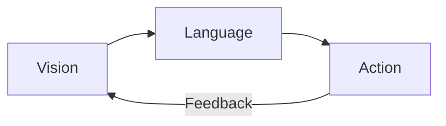

# Chapter 14: Module Summary and Assessment

:::note Learning Objectives
By the end of this chapter, you will be able to:
- Demonstrate comprehensive understanding of VLA systems
- Apply VLA concepts to solve real-world robotics problems
- Evaluate VLA architectures and make design decisions
- Identify areas for further learning and specialization
:::

## Module 4 Summary

Throughout this module, you have learned to build complete Vision-Language-Action systems for humanoid robots. Let us review the key concepts from each chapter.

### Chapter 1: What is VLA?

**Key Concepts:**
- VLA integrates Vision (perception), Language (cognition), and Action (execution)
- VLA represents the evolution from classical to intelligent robotics
- Foundation models enable natural human-robot interaction



### Chapter 2: The VLA Pipeline

**Key Concepts:**
- Six-stage pipeline: Voice Input, ASR, NLU, Planning, Safety, Execution
- Each stage transforms data toward actionable robot commands
- Latency requirements dictate design choices

### Chapter 3: Voice Commands with Whisper

**Key Concepts:**
- Whisper provides robust speech recognition
- Model size trades off accuracy vs latency
- Voice Activity Detection enables natural conversation

### Chapter 4: Natural Language Parsing

**Key Concepts:**
- Intent classification identifies the user's goal
- Entity extraction captures objects, locations, attributes
- Ambiguity resolution ensures clear understanding

### Chapter 5: LLM-Based Planning

**Key Concepts:**
- LLMs serve as the cognitive reasoning engine
- Prompt engineering is critical for reliable plans
- Plans must be grounded in robot capabilities

### Chapter 6: Safety Guardrails

**Key Concepts:**
- Multi-layered safety architecture (semantic, physical, human)
- Safety validation is non-negotiable
- Emergency stop must always work

### Chapter 7: Perception Integration

**Key Concepts:**
- Multiple detection methods for robustness
- Object tracking maintains consistent IDs
- World state aggregates all perception

### Chapter 8: Grasp Planning

**Key Concepts:**
- Object selection from natural language descriptions
- Grasp candidates evaluated on multiple criteria
- Recovery from grasp failures

### Chapter 9: Navigation with LLM Goals

**Key Concepts:**
- Semantic maps bridge language and coordinates
- Nav2 provides robust path planning
- Dynamic goals follow moving targets

### Chapter 10: Manipulator Control

**Key Concepts:**
- MoveIt2 for collision-free motion planning
- Force control for gentle manipulation
- High-level skills abstract complexity

### Chapter 11: VLA Agent Loop

**Key Concepts:**
- State machine provides behavior structure
- Async operations enable concurrent execution
- Recovery handles inevitable failures

### Chapter 12: Capstone Project

**Key Concepts:**
- Integration of all components into ARIA
- Real-world scenario testing
- Complete voice-controlled humanoid

### Chapter 13: Testing and Failure Analysis

**Key Concepts:**
- Comprehensive test coverage at all levels
- Failure mode tracking enables improvement
- Metrics drive system optimization

---

## Multiple Choice Questions

### Section A: Fundamentals (20 Questions)

**Q1.** What does VLA stand for in robotics?

a) Virtual Learning Algorithm
b) Vision-Language-Action
c) Voice-Linked Automation
d) Visual Language Architecture

<details>
<summary>Answer</summary>
**b) Vision-Language-Action** - VLA integrates perception (Vision), cognition (Language), and execution (Action) into unified robotic systems.
</details>

**Q2.** What is the primary role of Whisper in a VLA system?

a) Image processing
b) Motion planning
c) Speech recognition
d) Safety monitoring

<details>
<summary>Answer</summary>
**c) Speech recognition** - Whisper converts spoken commands into text for the NLU pipeline.
</details>

**Q3.** Which Whisper model provides the best balance of speed and accuracy for real-time robotics?

a) tiny
b) base or small
c) large-v3
d) medium

<details>
<summary>Answer</summary>
**b) base or small** - These models provide good accuracy with acceptable latency for real-time applications.
</details>

**Q4.** What is Voice Activity Detection (VAD) used for?

a) Translating speech to text
b) Detecting when someone is speaking
c) Planning robot motions
d) Object recognition

<details>
<summary>Answer</summary>
**b) Detecting when someone is speaking** - VAD identifies speech segments to trigger ASR processing efficiently.
</details>

**Q5.** What does intent classification determine?

a) The user's name
b) The user's location
c) The user's goal or desired action
d) The robot's battery level

<details>
<summary>Answer</summary>
**c) The user's goal or desired action** - Intent classification identifies what the user wants the robot to do.
</details>

**Q6.** What is entity extraction in NLU?

a) Removing unwanted data
b) Identifying specific items like objects, colors, locations
c) Compressing the command
d) Translating to another language

<details>
<summary>Answer</summary>
**b) Identifying specific items like objects, colors, locations** - Entity extraction pulls out key information from the command.
</details>

**Q7.** What is the primary benefit of using LLMs for robot planning?

a) Lower cost
b) Faster execution
c) Flexible reasoning and task decomposition
d) Higher battery efficiency

<details>
<summary>Answer</summary>
**c) Flexible reasoning and task decomposition** - LLMs can understand complex commands and break them into executable steps.
</details>

**Q8.** Why should LLM plans be output as structured JSON?

a) It looks nicer
b) Reliable parsing and validation
c) Smaller file size
d) Required by ROS 2

<details>
<summary>Answer</summary>
**b) Reliable parsing and validation** - JSON enables deterministic parsing of plan steps and parameters.
</details>

**Q9.** What is the purpose of safety guardrails in VLA?

a) Improve robot speed
b) Prevent unsafe actions
c) Reduce costs
d) Enhance voice quality

<details>
<summary>Answer</summary>
**b) Prevent unsafe actions** - Safety guardrails validate plans to ensure robot operations are safe.
</details>

**Q10.** What is the minimum response time requirement for emergency stop (E-Stop)?

a) < 1 second
b) < 100 ms
c) < 10 ms
d) < 1 ms

<details>
<summary>Answer</summary>
**c) < 10 ms** - Hardware-level E-Stop must respond within 10ms to prevent harm.
</details>

**Q11.** What does YOLO stand for?

a) You Only Live Once
b) You Only Look Once
c) Your Object Localization Output
d) Yellow Object Laser Operator

<details>
<summary>Answer</summary>
**b) You Only Look Once** - YOLO is a real-time object detection algorithm.
</details>

**Q12.** What is open-vocabulary detection?

a) Detecting objects with labels
b) Detecting objects based on text descriptions
c) Detecting open doors
d) Voice-activated detection

<details>
<summary>Answer</summary>
**b) Detecting objects based on text descriptions** - Open-vocabulary detectors like Grounding DINO can find objects matching natural language queries.
</details>

**Q13.** What is the purpose of object tracking in manipulation?

a) Finding new objects
b) Maintaining consistent object IDs across frames
c) Measuring robot speed
d) Planning navigation

<details>
<summary>Answer</summary>
**b) Maintaining consistent object IDs across frames** - Tracking ensures the robot follows the same object during manipulation.
</details>

**Q14.** What is a grasp candidate?

a) A person being interviewed
b) A potential grasp pose for picking an object
c) A training example
d) A failed grasp attempt

<details>
<summary>Answer</summary>
**b) A potential grasp pose for picking an object** - Grasp candidates are evaluated to find the best way to pick up an object.
</details>

**Q15.** What is grasp quality evaluation based on?

a) Object color only
b) Reachability, collision, stability, and force closure
c) Robot battery level
d) User preference

<details>
<summary>Answer</summary>
**b) Reachability, collision, stability, and force closure** - Multiple factors determine how likely a grasp is to succeed.
</details>

**Q16.** What is a semantic location map?

a) A regular occupancy grid
b) A map linking location names to coordinates
c) A 3D point cloud
d) A satellite image

<details>
<summary>Answer</summary>
**b) A map linking location names to coordinates** - Semantic maps enable commands like "go to the kitchen."
</details>

**Q17.** What navigation stack is commonly used with ROS 2?

a) Google Maps
b) Nav2
c) OpenCV
d) TensorFlow

<details>
<summary>Answer</summary>
**b) Nav2** - Nav2 is the standard navigation stack for ROS 2 robots.
</details>

**Q18.** What does MoveIt2 provide for manipulation?

a) Speech recognition
b) Motion planning
c) Object detection
d) Battery management

<details>
<summary>Answer</summary>
**b) Motion planning** - MoveIt2 plans collision-free paths for robot arm motions.
</details>

**Q19.** What is force control used for in manipulation?

a) Moving faster
b) Gentle and adaptive object handling
c) Navigation
d) Speech synthesis

<details>
<summary>Answer</summary>
**b) Gentle and adaptive object handling** - Force control enables the robot to handle objects without damage.
</details>

**Q20.** What is the VLA agent state machine used for?

a) Battery monitoring
b) Organizing agent behavior into clear states
c) Image processing
d) Network communication

<details>
<summary>Answer</summary>
**b) Organizing agent behavior into clear states** - The state machine provides structure for agent behavior (idle, listening, executing, etc.).
</details>

### Section B: Application (10 Questions)

**Q21.** A user says "Get me the red cup from the table." Which entities should the NLU extract?

a) Object: cup, Color: red, Location: table
b) Intent: GET, Object: cup
c) Object: table, Action: get
d) Color: red only

<details>
<summary>Answer</summary>
**a) Object: cup, Color: red, Location: table** - All relevant entities should be extracted for complete understanding.
</details>

**Q22.** The LLM generates a plan to "throw knife at target." What should happen?

a) Execute immediately
b) Safety guardrail rejects the plan
c) Ask for confirmation
d) Modify to throw softer

<details>
<summary>Answer</summary>
**b) Safety guardrail rejects the plan** - Dangerous actions must be blocked by semantic safety filtering.
</details>

**Q23.** During navigation, a human walks into the robot's path. What zone classification triggers slowdown?

a) Safe zone
b) Caution zone
c) Warning zone
d) Danger zone

<details>
<summary>Answer</summary>
**c) Warning zone** - Warning zone (0.5-1.5m) triggers speed reduction. Danger zone triggers stop.
</details>

**Q24.** A grasp fails because the object slipped. What is the appropriate recovery action?

a) Give up
b) Open gripper, try alternative grasp pose
c) Navigate away
d) Ask user to pick it up

<details>
<summary>Answer</summary>
**b) Open gripper, try alternative grasp pose** - Manipulation recovery should attempt alternative grasps before failing.
</details>

**Q25.** For a task "bring me my phone from the bedroom", what is the correct plan structure?

a) grasp(phone) only
b) navigate(bedroom), scan, approach(phone), grasp, navigate(user), handover
c) navigate(phone)
d) scan, grasp, navigate

<details>
<summary>Answer</summary>
**b) navigate(bedroom), scan, approach(phone), grasp, navigate(user), handover** - Complete multi-step plan for the task.
</details>

**Q26.** If ASR returns "peck up the cup" instead of "pick up the cup", what happens?

a) System crashes
b) NLU should still recognize PICK intent
c) Robot picks a cup randomly
d) Nothing happens

<details>
<summary>Answer</summary>
**b) NLU should still recognize PICK intent** - Robust NLU handles minor transcription errors through fuzzy matching.
</details>

**Q27.** The robot detects two cups: red and blue. User says "get the cup." What should happen?

a) Pick the closest one
b) Pick randomly
c) Ask for clarification: "Which cup - red or blue?"
d) Pick both

<details>
<summary>Answer</summary>
**c) Ask for clarification: "Which cup - red or blue?"** - Ambiguous references should trigger clarification.
</details>

**Q28.** During plan execution, step 3 of 5 fails. What should the agent do first?

a) Start from step 1
b) Skip to step 4
c) Attempt recovery for step 3
d) Return to idle

<details>
<summary>Answer</summary>
**c) Attempt recovery for step 3** - The agent should try to recover before failing the task or skipping.
</details>

**Q29.** What is the acceptable total voice-to-action latency for interactive VLA?

a) < 100ms
b) < 1 second
c) 3-5 seconds
d) > 10 seconds

<details>
<summary>Answer</summary>
**c) 3-5 seconds** - Users expect response within a few seconds for natural interaction.
</details>

**Q30.** Which test type is most important for VLA safety?

a) Unit tests
b) Performance tests
c) Safety constraint validation tests
d) Integration tests

<details>
<summary>Answer</summary>
**c) Safety constraint validation tests** - Safety tests must cover 100% of safety requirements.
</details>

---

## Practical Exercises

### Exercise 1: Design a VLA Prompt

Design an LLM system prompt for a robot that helps elderly users with medication reminders and retrieval. Include:

1. Robot capabilities
2. Safety rules specific to medication handling
3. Output format specification

**Evaluation Criteria:**
- Clarity of capability definition (30%)
- Appropriate safety rules (40%)
- Correct output format (30%)

### Exercise 2: Failure Mode Analysis

Given this scenario: "Robot attempts to pick up a glass, but drops it during lift."

1. Identify the failure mode category
2. List three possible root causes
3. Propose a recovery strategy
4. Suggest a preventive improvement

**Evaluation Criteria:**
- Correct failure classification (25%)
- Plausible root causes (25%)
- Viable recovery strategy (25%)
- Practical improvement suggestion (25%)

### Exercise 3: Test Case Design

Create 5 test cases for the NLU component that cover:

1. Basic command parsing
2. Entity extraction
3. Ambiguity detection
4. Error handling
5. Edge case (your choice)

For each test case, specify:
- Test ID and name
- Input text
- Expected output
- Pass/fail criteria

**Evaluation Criteria:**
- Coverage of required categories (40%)
- Clarity of inputs and outputs (30%)
- Appropriate pass/fail criteria (30%)

### Exercise 4: Architecture Diagram

Draw a complete architecture diagram for a VLA system that:

1. Operates in a hospital environment
2. Handles patient requests for items
3. Includes nurse notification for certain requests
4. Has strict safety requirements

Include all major components and data flows.

**Evaluation Criteria:**
- Component completeness (25%)
- Correct data flow (25%)
- Domain-specific adaptations (25%)
- Safety considerations (25%)

### Exercise 5: Code Implementation

Implement a function that selects the best grasp from a list of candidates based on:

```python
def select_best_grasp(
    candidates: List[GraspCandidate],
    object_type: str,
    is_fragile: bool
) -> GraspCandidate:
    """
    Select best grasp considering:
    - Quality score
    - Object type (adjust force)
    - Fragility (reduce force for fragile)

    Returns the best grasp candidate
    """
    # Your implementation here
    pass
```

**Evaluation Criteria:**
- Correct logic (40%)
- Handles all cases (30%)
- Code quality (30%)

---

## Module Completion Checklist

Before considering this module complete, verify:

- [ ] I can explain the VLA paradigm and its components
- [ ] I can implement speech recognition with Whisper
- [ ] I can design NLU pipelines for robot commands
- [ ] I can create LLM prompts for task planning
- [ ] I can implement safety guardrails
- [ ] I can integrate perception with VLA systems
- [ ] I can plan robot grasps from descriptions
- [ ] I can use Nav2 for semantic navigation
- [ ] I can implement manipulation skills
- [ ] I can build a complete VLA agent loop
- [ ] I can test and analyze VLA system failures
- [ ] I have completed the capstone project

---

## Further Learning Resources

### Books
- "Modern Robotics: Mechanics, Planning, and Control" - Lynch & Park
- "Robot Modeling and Control" - Spong, Hutchinson, Vidyasagar
- "Speech and Language Processing" - Jurafsky & Martin

### Online Courses
- ROS 2 Navigation Stack (nav2.org)
- MoveIt2 Tutorials (moveit.ros.org)
- Hugging Face NLP Course

### Research Papers
- "RT-2: Vision-Language-Action Models" - Google DeepMind
- "PaLM-E: An Embodied Multimodal Language Model" - Google
- "SayCan: Grounding Language in Robotic Affordances" - Google

### Communities
- ROS Discourse (discourse.ros.org)
- Robotics Stack Exchange
- Hugging Face Forums

---

## Congratulations!

You have completed Module 4: Vision-Language-Action for Humanoid Robotics. You now have the knowledge and skills to build intelligent, voice-controlled humanoid robots that can understand natural language, reason about tasks, and execute physical actions safely.

The future of robotics is conversational, and you are now equipped to build it.

**Next Steps:**
- Build and deploy your capstone project
- Contribute to open-source VLA projects
- Explore advanced topics like learning from demonstration
- Join the robotics community and share your work

Good luck on your journey in humanoid robotics!
