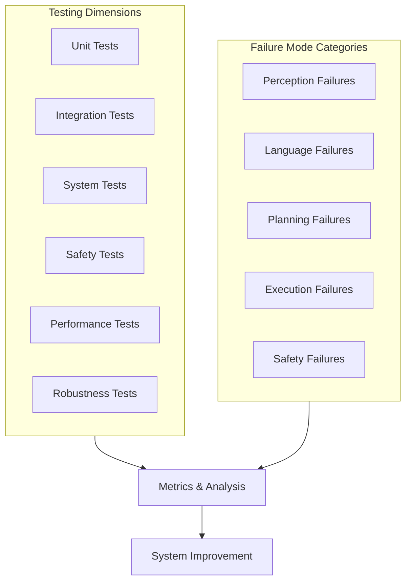

# Chapter 13: Testing VLA Systems and Failure Mode Analysis

:::note Learning Objectives
By the end of this chapter, you will be able to:
- Design comprehensive test suites for VLA systems
- Identify and categorize common failure modes
- Implement metrics for VLA system evaluation
- Build automated testing pipelines for continuous validation
- Create simulation-based test environments
- Document and analyze failure patterns for improvement
:::

## The Importance of Rigorous Testing

VLA systems operate in the physical world where failures can have real consequences. Unlike pure software systems, a VLA robot interacting with humans and objects requires exhaustive testing across multiple dimensions.



## VLA Testing Framework

### Test Categories and Coverage

| Test Category | Purpose | Coverage Target |
|--------------|---------|-----------------|
| Unit Tests | Individual component validation | > 80% code coverage |
| Integration Tests | Component interaction | All interface contracts |
| System Tests | End-to-end scenarios | 50+ real-world scenarios |
| Safety Tests | Safety constraint validation | 100% safety requirements |
| Performance Tests | Latency and throughput | All timing requirements |
| Robustness Tests | Edge cases and failures | Known failure modes |

### Testing Infrastructure

```python
#!/usr/bin/env python3
"""
VLA Testing Framework
"""

import pytest
import rclpy
from rclpy.node import Node
import asyncio
from dataclasses import dataclass, field
from typing import List, Dict, Any, Optional
from enum import Enum
import json
import time

class TestResult(Enum):
    PASSED = "passed"
    FAILED = "failed"
    SKIPPED = "skipped"
    ERROR = "error"


@dataclass
class TestCase:
    """Definition of a test case"""
    test_id: str
    name: str
    category: str
    description: str
    setup: Optional[Dict[str, Any]] = None
    input_data: Dict[str, Any] = field(default_factory=dict)
    expected_output: Dict[str, Any] = field(default_factory=dict)
    timeout_seconds: float = 30.0
    tags: List[str] = field(default_factory=list)


@dataclass
class TestResultRecord:
    """Record of test execution"""
    test_case: TestCase
    result: TestResult
    actual_output: Dict[str, Any]
    execution_time: float
    error_message: Optional[str] = None
    logs: List[str] = field(default_factory=list)


class VLATestRunner:
    """
    Test runner for VLA system tests
    """

    def __init__(self, test_node: Node):
        self.node = test_node
        self.results: List[TestResultRecord] = []

    async def run_test(self, test_case: TestCase) -> TestResultRecord:
        """Run a single test case"""
        start_time = time.time()
        result = TestResult.PASSED
        actual_output = {}
        error_message = None
        logs = []

        try:
            # Setup
            if test_case.setup:
                await self._setup_test(test_case.setup)

            # Execute test
            actual_output = await self._execute_test(
                test_case.input_data,
                test_case.timeout_seconds
            )

            # Validate output
            if not self._validate_output(actual_output, test_case.expected_output):
                result = TestResult.FAILED
                error_message = "Output validation failed"

        except asyncio.TimeoutError:
            result = TestResult.FAILED
            error_message = f"Test timed out after {test_case.timeout_seconds}s"
        except Exception as e:
            result = TestResult.ERROR
            error_message = str(e)

        execution_time = time.time() - start_time

        record = TestResultRecord(
            test_case=test_case,
            result=result,
            actual_output=actual_output,
            execution_time=execution_time,
            error_message=error_message,
            logs=logs
        )

        self.results.append(record)
        return record

    async def run_test_suite(self, test_cases: List[TestCase]) -> Dict:
        """Run all tests in a suite"""
        for test_case in test_cases:
            self.node.get_logger().info(f'Running test: {test_case.name}')
            await self.run_test(test_case)

        return self.generate_report()

    def generate_report(self) -> Dict:
        """Generate test report"""
        total = len(self.results)
        passed = sum(1 for r in self.results if r.result == TestResult.PASSED)
        failed = sum(1 for r in self.results if r.result == TestResult.FAILED)
        errors = sum(1 for r in self.results if r.result == TestResult.ERROR)

        return {
            'summary': {
                'total': total,
                'passed': passed,
                'failed': failed,
                'errors': errors,
                'pass_rate': passed / total if total > 0 else 0
            },
            'results': [
                {
                    'test_id': r.test_case.test_id,
                    'name': r.test_case.name,
                    'result': r.result.value,
                    'time': r.execution_time,
                    'error': r.error_message
                }
                for r in self.results
            ]
        }

    async def _setup_test(self, setup: Dict):
        """Setup test environment"""
        pass

    async def _execute_test(self, input_data: Dict, timeout: float) -> Dict:
        """Execute test and return results"""
        return {}

    def _validate_output(self, actual: Dict, expected: Dict) -> bool:
        """Validate test output"""
        for key, expected_value in expected.items():
            if key not in actual:
                return False
            if actual[key] != expected_value:
                return False
        return True
```

## Speech Recognition Tests

```python
class ASRTestSuite:
    """Test suite for Automatic Speech Recognition"""

    TEST_CASES = [
        # Basic commands
        TestCase(
            test_id="asr_001",
            name="Basic pick command",
            category="asr",
            input_data={'audio_file': 'pick_up_cup.wav'},
            expected_output={'text': 'pick up the cup', 'confidence': 0.9},
            tags=['basic', 'manipulation']
        ),
        TestCase(
            test_id="asr_002",
            name="Navigation command",
            category="asr",
            input_data={'audio_file': 'go_to_kitchen.wav'},
            expected_output={'text': 'go to the kitchen', 'confidence': 0.9},
            tags=['basic', 'navigation']
        ),

        # Noisy conditions
        TestCase(
            test_id="asr_010",
            name="Command with background noise",
            category="asr",
            input_data={'audio_file': 'pick_cup_noisy.wav', 'snr_db': 10},
            expected_output={'text': 'pick up the cup', 'confidence': 0.7},
            tags=['robustness', 'noise']
        ),

        # Accents and variations
        TestCase(
            test_id="asr_020",
            name="British accent",
            category="asr",
            input_data={'audio_file': 'bring_torch_british.wav'},
            expected_output={'text': 'bring me the torch', 'confidence': 0.8},
            tags=['robustness', 'accent']
        ),

        # Edge cases
        TestCase(
            test_id="asr_030",
            name="Very short command",
            category="asr",
            input_data={'audio_file': 'stop.wav'},
            expected_output={'text': 'stop', 'confidence': 0.9},
            tags=['edge_case']
        ),
        TestCase(
            test_id="asr_031",
            name="Long complex command",
            category="asr",
            input_data={'audio_file': 'complex_command.wav'},
            expected_output={
                'text': 'go to the kitchen and get the red cup then bring it to the living room',
                'confidence': 0.8
            },
            tags=['edge_case', 'complex']
        )
    ]


@pytest.fixture
def asr_node():
    rclpy.init()
    node = WhisperASRNode()
    yield node
    node.destroy_node()
    rclpy.shutdown()


class TestASR:
    """ASR Test Class"""

    @pytest.mark.parametrize("test_case", ASRTestSuite.TEST_CASES)
    def test_transcription(self, asr_node, test_case):
        """Test transcription accuracy"""
        audio_file = test_case.input_data['audio_file']
        expected_text = test_case.expected_output['text']
        min_confidence = test_case.expected_output['confidence']

        result = asr_node.transcribe_file(audio_file)

        # Check text similarity (allowing for minor variations)
        similarity = self._compute_similarity(result.text, expected_text)
        assert similarity > 0.9, f"Text mismatch: '{result.text}' vs '{expected_text}'"

        # Check confidence
        assert result.confidence >= min_confidence * 0.9

    def _compute_similarity(self, text1: str, text2: str) -> float:
        """Compute text similarity using word overlap"""
        words1 = set(text1.lower().split())
        words2 = set(text2.lower().split())
        intersection = words1 & words2
        union = words1 | words2
        return len(intersection) / len(union) if union else 0
```

## NLU and Planning Tests

```python
class NLUTestSuite:
    """Test suite for Natural Language Understanding"""

    TEST_CASES = [
        # Intent classification
        TestCase(
            test_id="nlu_001",
            name="Pick intent detection",
            category="nlu_intent",
            input_data={'text': 'grab the red apple'},
            expected_output={'intent': 'PICK', 'confidence': 0.9}
        ),
        TestCase(
            test_id="nlu_002",
            name="Navigate intent detection",
            category="nlu_intent",
            input_data={'text': 'go to the bedroom'},
            expected_output={'intent': 'GO_TO', 'confidence': 0.9}
        ),

        # Entity extraction
        TestCase(
            test_id="nlu_010",
            name="Object entity extraction",
            category="nlu_entity",
            input_data={'text': 'pick up the red cup on the table'},
            expected_output={
                'entities': {
                    'object': 'cup',
                    'color': 'red',
                    'location': 'table'
                }
            }
        ),

        # Ambiguity handling
        TestCase(
            test_id="nlu_020",
            name="Ambiguous reference",
            category="nlu_ambiguity",
            input_data={
                'text': 'pick up the cup',
                'world_state': {'objects': ['red_cup', 'blue_cup']}
            },
            expected_output={
                'requires_clarification': True,
                'clarification_type': 'object_ambiguity'
            }
        )
    ]


class PlanningTestSuite:
    """Test suite for LLM Planning"""

    TEST_CASES = [
        # Simple plans
        TestCase(
            test_id="plan_001",
            name="Simple pick plan",
            category="planning",
            input_data={
                'command': 'pick up the cup',
                'world_state': {
                    'robot_location': 'living_room',
                    'objects': [{'name': 'cup', 'location': 'table'}]
                }
            },
            expected_output={
                'has_plan': True,
                'step_count_range': (2, 5),
                'contains_actions': ['approach', 'grasp']
            }
        ),

        # Complex multi-step plans
        TestCase(
            test_id="plan_010",
            name="Multi-location task",
            category="planning",
            input_data={
                'command': 'get the cup from the kitchen and bring it to the bedroom',
                'world_state': {
                    'robot_location': 'living_room',
                    'known_locations': ['kitchen', 'bedroom', 'living_room']
                }
            },
            expected_output={
                'has_plan': True,
                'step_count_range': (5, 10),
                'contains_actions': ['navigate_to', 'grasp', 'navigate_to', 'place_on']
            }
        ),

        # Impossible task
        TestCase(
            test_id="plan_020",
            name="Impossible task handling",
            category="planning",
            input_data={
                'command': 'fly to the moon',
                'world_state': {}
            },
            expected_output={
                'has_plan': False,
                'rejection_reason': 'capability_limitation'
            }
        )
    ]
```

## Failure Mode Analysis

### Failure Mode Taxonomy

```python
class FailureMode(Enum):
    """Taxonomy of VLA failure modes"""

    # Perception failures
    PERCEPTION_OBJECT_NOT_DETECTED = "perception.object_not_detected"
    PERCEPTION_WRONG_OBJECT = "perception.wrong_object"
    PERCEPTION_POSITION_ERROR = "perception.position_error"
    PERCEPTION_OCCLUSION = "perception.occlusion"

    # Speech failures
    SPEECH_NOT_RECOGNIZED = "speech.not_recognized"
    SPEECH_WRONG_TRANSCRIPTION = "speech.wrong_transcription"
    SPEECH_NOISE_INTERFERENCE = "speech.noise_interference"

    # Language understanding failures
    NLU_WRONG_INTENT = "nlu.wrong_intent"
    NLU_MISSING_ENTITY = "nlu.missing_entity"
    NLU_AMBIGUITY = "nlu.ambiguity"

    # Planning failures
    PLANNING_NO_PLAN = "planning.no_plan"
    PLANNING_INVALID_PLAN = "planning.invalid_plan"
    PLANNING_UNSAFE_PLAN = "planning.unsafe_plan"

    # Navigation failures
    NAV_PATH_BLOCKED = "navigation.path_blocked"
    NAV_LOCALIZATION_LOST = "navigation.localization_lost"
    NAV_TIMEOUT = "navigation.timeout"

    # Manipulation failures
    MANIP_GRASP_FAILED = "manipulation.grasp_failed"
    MANIP_OBJECT_DROPPED = "manipulation.object_dropped"
    MANIP_COLLISION = "manipulation.collision"
    MANIP_UNREACHABLE = "manipulation.unreachable"

    # Safety failures
    SAFETY_HUMAN_TOO_CLOSE = "safety.human_too_close"
    SAFETY_FORCE_EXCEEDED = "safety.force_exceeded"
    SAFETY_ESTOP_TRIGGERED = "safety.estop_triggered"


@dataclass
class FailureRecord:
    """Record of a failure occurrence"""
    failure_mode: FailureMode
    timestamp: float
    context: Dict[str, Any]
    severity: str  # 'low', 'medium', 'high', 'critical'
    recovered: bool
    recovery_action: Optional[str]
    root_cause: Optional[str]


class FailureModeAnalyzer:
    """
    Analyzes failure modes to identify patterns and improvements
    """

    def __init__(self):
        self.failure_records: List[FailureRecord] = []

    def record_failure(
        self,
        failure_mode: FailureMode,
        context: Dict[str, Any],
        severity: str = 'medium',
        recovered: bool = False,
        recovery_action: Optional[str] = None
    ):
        """Record a failure occurrence"""
        record = FailureRecord(
            failure_mode=failure_mode,
            timestamp=time.time(),
            context=context,
            severity=severity,
            recovered=recovered,
            recovery_action=recovery_action,
            root_cause=None
        )
        self.failure_records.append(record)

    def analyze_patterns(self) -> Dict:
        """Analyze failure patterns"""
        # Count by mode
        mode_counts = {}
        for record in self.failure_records:
            mode = record.failure_mode.value
            mode_counts[mode] = mode_counts.get(mode, 0) + 1

        # Calculate recovery rates
        recovery_rates = {}
        for mode in FailureMode:
            mode_records = [r for r in self.failure_records if r.failure_mode == mode]
            if mode_records:
                recovered = sum(1 for r in mode_records if r.recovered)
                recovery_rates[mode.value] = recovered / len(mode_records)

        # Identify top failure modes
        sorted_modes = sorted(mode_counts.items(), key=lambda x: x[1], reverse=True)

        return {
            'total_failures': len(self.failure_records),
            'failures_by_mode': mode_counts,
            'recovery_rates': recovery_rates,
            'top_5_failures': sorted_modes[:5],
            'critical_failures': sum(1 for r in self.failure_records if r.severity == 'critical')
        }

    def generate_improvement_recommendations(self) -> List[Dict]:
        """Generate recommendations based on failure analysis"""
        analysis = self.analyze_patterns()
        recommendations = []

        for mode, count in analysis['top_5_failures']:
            if 'perception' in mode:
                recommendations.append({
                    'area': 'perception',
                    'issue': mode,
                    'count': count,
                    'recommendation': 'Improve object detection model or add more training data'
                })
            elif 'navigation' in mode:
                recommendations.append({
                    'area': 'navigation',
                    'issue': mode,
                    'count': count,
                    'recommendation': 'Tune navigation parameters or improve mapping'
                })
            elif 'manipulation' in mode:
                recommendations.append({
                    'area': 'manipulation',
                    'issue': mode,
                    'count': count,
                    'recommendation': 'Improve grasp planning or add force feedback'
                })

        return recommendations
```

## Performance Metrics

```python
@dataclass
class VLAMetrics:
    """Comprehensive VLA system metrics"""

    # Timing metrics
    voice_to_action_latency: float  # Time from speech end to action start
    planning_latency: float  # Time for LLM to generate plan
    perception_latency: float  # Time for object detection
    navigation_time: float  # Average navigation time
    manipulation_time: float  # Average manipulation time

    # Success metrics
    task_success_rate: float  # Percentage of tasks completed
    asr_accuracy: float  # Word Error Rate
    intent_accuracy: float  # Intent classification accuracy
    navigation_success_rate: float
    manipulation_success_rate: float

    # Safety metrics
    safety_violations: int  # Number of safety violations
    human_proximity_incidents: int
    force_limit_breaches: int

    # Robustness metrics
    recovery_success_rate: float
    mean_time_between_failures: float


class MetricsCollector:
    """
    Collects and computes VLA system metrics
    """

    def __init__(self):
        self.task_results = []
        self.timing_samples = []
        self.safety_events = []

    def record_task_completion(
        self,
        task_id: str,
        success: bool,
        duration: float,
        steps_completed: int,
        total_steps: int
    ):
        """Record task completion"""
        self.task_results.append({
            'task_id': task_id,
            'success': success,
            'duration': duration,
            'steps_completed': steps_completed,
            'total_steps': total_steps,
            'timestamp': time.time()
        })

    def record_timing(
        self,
        stage: str,
        duration: float
    ):
        """Record timing for a stage"""
        self.timing_samples.append({
            'stage': stage,
            'duration': duration,
            'timestamp': time.time()
        })

    def compute_metrics(self, time_window: float = 3600) -> VLAMetrics:
        """Compute metrics for time window (default 1 hour)"""
        cutoff = time.time() - time_window

        # Filter recent data
        recent_tasks = [t for t in self.task_results if t['timestamp'] > cutoff]
        recent_timings = [t for t in self.timing_samples if t['timestamp'] > cutoff]

        # Compute success rate
        if recent_tasks:
            success_rate = sum(1 for t in recent_tasks if t['success']) / len(recent_tasks)
        else:
            success_rate = 0.0

        # Compute average timings by stage
        stage_timings = {}
        for sample in recent_timings:
            stage = sample['stage']
            if stage not in stage_timings:
                stage_timings[stage] = []
            stage_timings[stage].append(sample['duration'])

        avg_timings = {
            stage: sum(times) / len(times)
            for stage, times in stage_timings.items()
        }

        return VLAMetrics(
            voice_to_action_latency=avg_timings.get('voice_to_action', 0),
            planning_latency=avg_timings.get('planning', 0),
            perception_latency=avg_timings.get('perception', 0),
            navigation_time=avg_timings.get('navigation', 0),
            manipulation_time=avg_timings.get('manipulation', 0),
            task_success_rate=success_rate,
            asr_accuracy=0.0,  # Would be computed from ASR tests
            intent_accuracy=0.0,
            navigation_success_rate=0.0,
            manipulation_success_rate=0.0,
            safety_violations=len(self.safety_events),
            human_proximity_incidents=0,
            force_limit_breaches=0,
            recovery_success_rate=0.0,
            mean_time_between_failures=0.0
        )
```

## Simulation-Based Testing

```python
class SimulationTestEnvironment:
    """
    Simulation environment for VLA testing
    """

    def __init__(self, gazebo_world: str = 'home_environment.world'):
        self.world = gazebo_world
        self.test_scenarios = []
        self.current_scenario = None

    def setup_scenario(self, scenario: Dict):
        """Setup a test scenario in simulation"""
        self.current_scenario = scenario

        # Spawn objects
        for obj in scenario.get('objects', []):
            self._spawn_object(
                obj['name'],
                obj['type'],
                obj['position']
            )

        # Set robot position
        if 'robot_position' in scenario:
            self._set_robot_position(scenario['robot_position'])

        # Setup human actors if needed
        for human in scenario.get('humans', []):
            self._spawn_human(human)

    def run_test(self, command: str, timeout: float = 60.0) -> Dict:
        """Run test with command"""
        start_time = time.time()

        # Send command to robot
        # Wait for completion or timeout

        return {
            'success': True,
            'duration': time.time() - start_time,
            'final_state': self._get_world_state()
        }

    def _spawn_object(self, name: str, obj_type: str, position: List[float]):
        """Spawn object in simulation"""
        pass

    def _set_robot_position(self, position: List[float]):
        """Set robot position"""
        pass

    def _spawn_human(self, human: Dict):
        """Spawn human actor"""
        pass

    def _get_world_state(self) -> Dict:
        """Get current world state from simulation"""
        return {}


# Example test scenarios
TEST_SCENARIOS = [
    {
        'name': 'Simple fetch',
        'objects': [
            {'name': 'cup_1', 'type': 'cup', 'position': [1.0, 0.5, 0.8]}
        ],
        'robot_position': [0.0, 0.0, 0.0],
        'command': 'pick up the cup',
        'expected_result': 'cup_in_gripper'
    },
    {
        'name': 'Navigate and fetch',
        'objects': [
            {'name': 'apple_1', 'type': 'apple', 'position': [5.0, 3.0, 0.8]}
        ],
        'robot_position': [0.0, 0.0, 0.0],
        'command': 'go to the kitchen and get the apple',
        'expected_result': 'apple_in_gripper'
    },
    {
        'name': 'Human avoidance',
        'objects': [
            {'name': 'book_1', 'type': 'book', 'position': [2.0, 1.0, 0.8]}
        ],
        'humans': [
            {'position': [1.0, 0.5, 0.0], 'behavior': 'standing'}
        ],
        'robot_position': [0.0, 0.0, 0.0],
        'command': 'get the book',
        'expected_result': 'book_in_gripper_no_human_contact'
    }
]
```

## Summary

In this chapter, you learned:

- How to design comprehensive test suites for VLA systems
- Categorizing and analyzing failure modes
- Collecting and computing performance metrics
- Building simulation-based test environments
- Continuous testing and improvement strategies

## Key Takeaways

:::tip Remember
1. **Test at multiple levels** - Unit, integration, system, and safety tests
2. **Track failure modes systematically** - Patterns reveal improvement opportunities
3. **Metrics drive improvement** - Measure what matters
4. **Simulation enables extensive testing** - Test scenarios impossible in reality
5. **Continuous testing catches regressions** - Automate everything
:::

## Next Steps

In the final chapter, we will review all module content with a comprehensive assessment including MCQs and practical exercises.

---

## Review Questions

1. What are the six main categories of VLA system tests?
2. How do you measure ASR accuracy?
3. What failure modes are most critical for safety?
4. Why is simulation-based testing important for VLA?
5. What metrics indicate overall VLA system health?

## Hands-On Exercise

Build a comprehensive test suite:

1. Create 10 ASR test cases with varying difficulty
2. Implement a failure mode recorder for your VLA system
3. Add timing instrumentation to measure all latencies
4. Create 5 simulation test scenarios
5. Generate a failure analysis report from collected data

Bonus: Build a CI/CD pipeline that runs tests on every code change.
