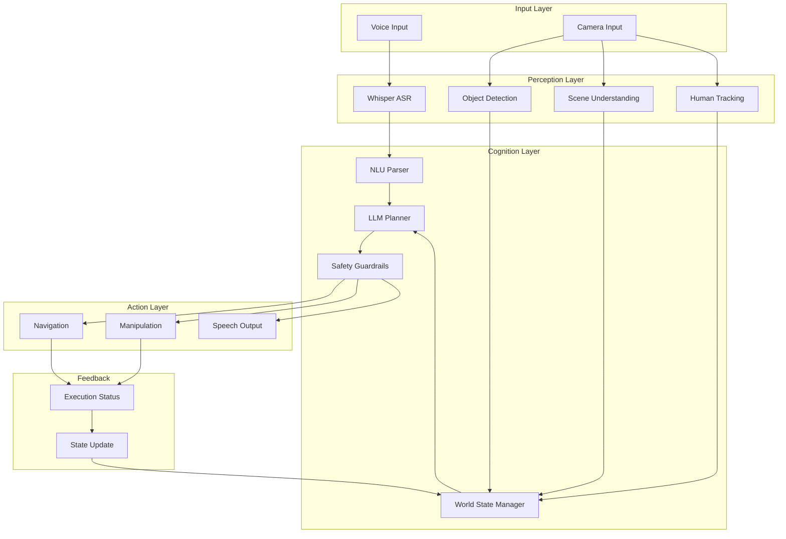
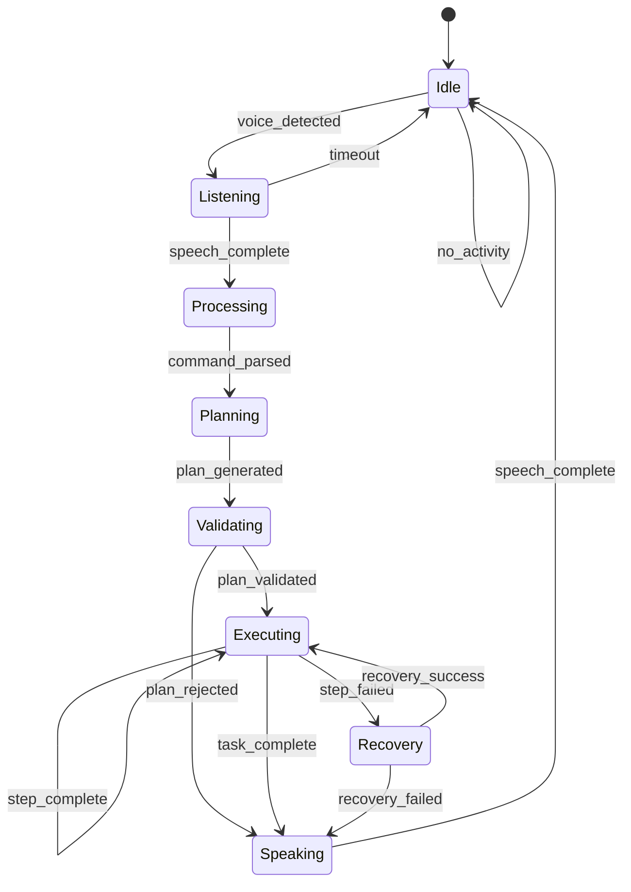

# Chapter 11: The Complete VLA Agent Loop

:::note Learning Objectives
By the end of this chapter, you will be able to:
- Design a complete VLA agent architecture
- Implement the perception-cognition-action loop
- Orchestrate multiple subsystems for coherent behavior
- Handle concurrent operations and state management
- Build a fault-tolerant agent with error recovery
- Create an interactive voice-controlled humanoid robot
:::

## The Unified Agent Architecture

The VLA agent loop brings together all components we have built throughout this module into a cohesive autonomous system.



## Agent State Machine

The VLA agent operates as a state machine:



## Core Agent Implementation

```python
#!/usr/bin/env python3
"""
Complete VLA Agent - Main Orchestration Node
"""

import rclpy
from rclpy.node import Node
from rclpy.callback_groups import ReentrantCallbackGroup
from rclpy.executors import MultiThreadedExecutor
from std_msgs.msg import String, Bool
from geometry_msgs.msg import PoseStamped
import asyncio
import json
from enum import Enum
from dataclasses import dataclass, field
from typing import Optional, Dict, Any, List
import time

class AgentState(Enum):
    """VLA Agent states"""
    IDLE = "idle"
    LISTENING = "listening"
    PROCESSING = "processing"
    PLANNING = "planning"
    VALIDATING = "validating"
    EXECUTING = "executing"
    RECOVERY = "recovery"
    SPEAKING = "speaking"


@dataclass
class AgentContext:
    """Current agent context and state"""
    state: AgentState = AgentState.IDLE
    current_command: Optional[str] = None
    current_plan: Optional[Dict] = None
    current_step_index: int = 0
    execution_start_time: float = 0.0
    error_count: int = 0
    conversation_history: List[Dict] = field(default_factory=list)


class VLAAgent(Node):
    """
    Main VLA Agent Node

    Orchestrates all VLA subsystems into a unified autonomous agent
    """

    def __init__(self):
        super().__init__('vla_agent')

        # Use reentrant callback group for async operations
        self.callback_group = ReentrantCallbackGroup()

        # Initialize context
        self.context = AgentContext()

        # Configuration
        self.declare_parameter('voice_timeout', 30.0)
        self.declare_parameter('execution_timeout', 120.0)
        self.declare_parameter('max_retries', 3)

        # Initialize subsystem interfaces
        self._init_subsystems()

        # Publishers
        self.state_pub = self.create_publisher(String, '/agent/state', 10)
        self.feedback_pub = self.create_publisher(String, '/agent/feedback', 10)
        self.speech_pub = self.create_publisher(String, '/speech/output', 10)

        # Subscribers
        self.speech_sub = self.create_subscription(
            String, '/speech/text', self.on_speech_received,
            10, callback_group=self.callback_group
        )
        self.estop_sub = self.create_subscription(
            Bool, '/safety/estop', self.on_estop,
            10, callback_group=self.callback_group
        )

        # Main agent loop timer
        self.create_timer(0.1, self.agent_loop, callback_group=self.callback_group)

        # Async event loop
        self.loop = asyncio.new_event_loop()

        self.get_logger().info('VLA Agent initialized and ready')
        self.speak("Hello! I am ready to help. What would you like me to do?")

    def _init_subsystems(self):
        """Initialize subsystem interfaces"""
        # These would be actual service/action clients in production
        self.asr_interface = None  # WhisperASRInterface
        self.nlu_interface = None  # NLUInterface
        self.planner_interface = None  # LLMPlannerInterface
        self.safety_interface = None  # SafetyInterface
        self.navigation_interface = None  # NavigationInterface
        self.manipulation_interface = None  # ManipulationInterface
        self.perception_interface = None  # PerceptionInterface

    def on_speech_received(self, msg: String):
        """Handle incoming speech transcription"""
        if self.context.state != AgentState.LISTENING:
            return

        self.context.current_command = msg.data
        self.transition_to(AgentState.PROCESSING)
        self.get_logger().info(f'Received command: "{msg.data}"')

    def on_estop(self, msg: Bool):
        """Handle emergency stop"""
        if msg.data:
            self.get_logger().error('EMERGENCY STOP ACTIVATED')
            self.context.state = AgentState.IDLE
            self.speak("Emergency stop activated. Stopping all operations.")

    def agent_loop(self):
        """Main agent control loop"""
        try:
            if self.context.state == AgentState.IDLE:
                self._handle_idle()
            elif self.context.state == AgentState.LISTENING:
                self._handle_listening()
            elif self.context.state == AgentState.PROCESSING:
                self.loop.run_until_complete(self._handle_processing())
            elif self.context.state == AgentState.PLANNING:
                self.loop.run_until_complete(self._handle_planning())
            elif self.context.state == AgentState.VALIDATING:
                self.loop.run_until_complete(self._handle_validating())
            elif self.context.state == AgentState.EXECUTING:
                self.loop.run_until_complete(self._handle_executing())
            elif self.context.state == AgentState.RECOVERY:
                self.loop.run_until_complete(self._handle_recovery())
            elif self.context.state == AgentState.SPEAKING:
                self._handle_speaking()
        except Exception as e:
            self.get_logger().error(f'Agent loop error: {e}')
            self.transition_to(AgentState.IDLE)

    def _handle_idle(self):
        """Handle idle state - wait for wake word or voice activity"""
        # In production, this would check for wake word detection
        # For now, always listening
        self.transition_to(AgentState.LISTENING)

    def _handle_listening(self):
        """Handle listening state - wait for speech input"""
        # Check for timeout
        voice_timeout = self.get_parameter('voice_timeout').value
        # Timeout handling would go here
        pass

    async def _handle_processing(self):
        """Process received speech through NLU"""
        command = self.context.current_command

        self.publish_feedback("Processing your request...")

        # Parse command through NLU
        parsed = await self._parse_command(command)

        if parsed is None:
            self.speak("I didn't understand that. Could you please rephrase?")
            self.transition_to(AgentState.IDLE)
            return

        if parsed.get('requires_clarification'):
            self.speak(parsed['clarification_question'])
            self.transition_to(AgentState.LISTENING)
            return

        # Store parsed command and move to planning
        self.context.current_command = parsed
        self.transition_to(AgentState.PLANNING)

    async def _handle_planning(self):
        """Generate plan using LLM"""
        self.publish_feedback("Planning how to help you...")

        # Get current world state
        world_state = await self._get_world_state()

        # Generate plan
        plan = await self._generate_plan(
            self.context.current_command,
            world_state
        )

        if plan is None:
            self.speak("I'm sorry, I couldn't figure out how to do that.")
            self.transition_to(AgentState.IDLE)
            return

        self.context.current_plan = plan
        self.transition_to(AgentState.VALIDATING)

    async def _handle_validating(self):
        """Validate plan through safety guardrails"""
        plan = self.context.current_plan

        # Run safety validation
        validation_result = await self._validate_plan(plan)

        if not validation_result['is_safe']:
            self.speak(f"I can't do that safely. {validation_result['reason']}")
            self.transition_to(AgentState.IDLE)
            return

        if validation_result.get('requires_confirmation'):
            self.speak(f"I'm about to {plan['task_summary']}. Should I proceed?")
            # Would wait for confirmation here
            # For now, proceed automatically
            pass

        # Start execution
        self.context.current_step_index = 0
        self.context.execution_start_time = time.time()
        self.speak(f"Got it. I'll {plan['task_summary']}.")
        self.transition_to(AgentState.EXECUTING)

    async def _handle_executing(self):
        """Execute current plan step by step"""
        plan = self.context.current_plan
        step_index = self.context.current_step_index
        steps = plan.get('steps', [])

        # Check if all steps complete
        if step_index >= len(steps):
            self.speak("Done! Task completed successfully.")
            self.transition_to(AgentState.IDLE)
            return

        # Check execution timeout
        execution_timeout = self.get_parameter('execution_timeout').value
        if time.time() - self.context.execution_start_time > execution_timeout:
            self.speak("The task is taking too long. Stopping.")
            self.transition_to(AgentState.IDLE)
            return

        # Execute current step
        current_step = steps[step_index]
        self.publish_feedback(f"Step {step_index + 1}: {current_step['description']}")

        result = await self._execute_step(current_step)

        if result['success']:
            self.context.current_step_index += 1
            self.context.error_count = 0
        else:
            self.context.error_count += 1
            if self.context.error_count >= self.get_parameter('max_retries').value:
                self.speak(f"I couldn't complete the step: {current_step['description']}")
                self.transition_to(AgentState.RECOVERY)
            else:
                self.publish_feedback(f"Retrying step... (attempt {self.context.error_count + 1})")

    async def _handle_recovery(self):
        """Handle task failure and recovery"""
        # Attempt recovery based on failure type
        recovery_result = await self._attempt_recovery()

        if recovery_result['success']:
            self.speak("I found a way to continue.")
            self.context.error_count = 0
            self.transition_to(AgentState.EXECUTING)
        else:
            self.speak(f"I'm sorry, I couldn't complete the task. {recovery_result['message']}")
            self.transition_to(AgentState.IDLE)

    def _handle_speaking(self):
        """Handle speech output completion"""
        # In production, would wait for TTS completion
        self.transition_to(AgentState.IDLE)

    # ==================== Subsystem Interfaces ====================

    async def _parse_command(self, command: str) -> Optional[Dict]:
        """Parse command through NLU"""
        # This would call NLU service
        # Simplified implementation
        return {
            'raw_text': command,
            'intent': 'PICK',  # Would be detected by NLU
            'entities': {},
            'requires_clarification': False
        }

    async def _get_world_state(self) -> Dict:
        """Get current world state from perception"""
        # This would call perception service
        return {
            'robot_location': 'living room',
            'gripper_state': 'open',
            'detected_objects': [],
            'known_locations': []
        }

    async def _generate_plan(
        self,
        parsed_command: Dict,
        world_state: Dict
    ) -> Optional[Dict]:
        """Generate plan using LLM planner"""
        # This would call LLM planning service
        return {
            'task_summary': 'pick up the red cup',
            'steps': [
                {
                    'id': 1,
                    'action': 'scan_area',
                    'parameters': {},
                    'description': 'Look for the red cup'
                },
                {
                    'id': 2,
                    'action': 'approach',
                    'parameters': {'object': 'red_cup'},
                    'description': 'Move to the red cup'
                },
                {
                    'id': 3,
                    'action': 'grasp',
                    'parameters': {'object': 'red_cup'},
                    'description': 'Pick up the red cup'
                }
            ],
            'estimated_duration': 30
        }

    async def _validate_plan(self, plan: Dict) -> Dict:
        """Validate plan through safety guardrails"""
        # This would call safety validation service
        return {
            'is_safe': True,
            'requires_confirmation': False
        }

    async def _execute_step(self, step: Dict) -> Dict:
        """Execute a single plan step"""
        action = step['action']
        parameters = step.get('parameters', {})

        self.get_logger().info(f'Executing: {action}({parameters})')

        try:
            if action == 'navigate_to':
                return await self._execute_navigation(parameters)
            elif action == 'approach':
                return await self._execute_approach(parameters)
            elif action == 'scan_area':
                return await self._execute_scan(parameters)
            elif action == 'grasp':
                return await self._execute_grasp(parameters)
            elif action == 'release':
                return await self._execute_release(parameters)
            elif action == 'place_on':
                return await self._execute_place(parameters)
            elif action == 'say':
                return await self._execute_speech(parameters)
            else:
                return {'success': False, 'error': f'Unknown action: {action}'}
        except Exception as e:
            return {'success': False, 'error': str(e)}

    async def _execute_navigation(self, params: Dict) -> Dict:
        """Execute navigation action"""
        # Would call navigation service
        location = params.get('location', '')
        self.publish_feedback(f"Navigating to {location}...")
        await asyncio.sleep(1)  # Simulated
        return {'success': True}

    async def _execute_approach(self, params: Dict) -> Dict:
        """Execute approach action"""
        obj = params.get('object', '')
        self.publish_feedback(f"Approaching {obj}...")
        await asyncio.sleep(1)
        return {'success': True}

    async def _execute_scan(self, params: Dict) -> Dict:
        """Execute scan/perception action"""
        self.publish_feedback("Scanning environment...")
        await asyncio.sleep(1)
        return {'success': True}

    async def _execute_grasp(self, params: Dict) -> Dict:
        """Execute grasp action"""
        obj = params.get('object', '')
        self.publish_feedback(f"Grasping {obj}...")
        await asyncio.sleep(1)
        return {'success': True}

    async def _execute_release(self, params: Dict) -> Dict:
        """Execute release action"""
        self.publish_feedback("Releasing object...")
        await asyncio.sleep(0.5)
        return {'success': True}

    async def _execute_place(self, params: Dict) -> Dict:
        """Execute place action"""
        surface = params.get('surface', '')
        self.publish_feedback(f"Placing object on {surface}...")
        await asyncio.sleep(1)
        return {'success': True}

    async def _execute_speech(self, params: Dict) -> Dict:
        """Execute speech action"""
        message = params.get('message', '')
        self.speak(message)
        return {'success': True}

    async def _attempt_recovery(self) -> Dict:
        """Attempt recovery from failure"""
        # This would implement recovery strategies
        return {'success': False, 'message': 'No recovery available'}

    # ==================== Utilities ====================

    def transition_to(self, new_state: AgentState):
        """Transition to new agent state"""
        old_state = self.context.state
        self.context.state = new_state

        self.get_logger().info(f'State: {old_state.value} -> {new_state.value}')

        # Publish state change
        msg = String()
        msg.data = json.dumps({
            'previous': old_state.value,
            'current': new_state.value,
            'timestamp': time.time()
        })
        self.state_pub.publish(msg)

    def speak(self, text: str):
        """Output speech"""
        msg = String()
        msg.data = text
        self.speech_pub.publish(msg)
        self.get_logger().info(f'Speaking: "{text}"')

        # Add to conversation history
        self.context.conversation_history.append({
            'role': 'assistant',
            'content': text,
            'timestamp': time.time()
        })

    def publish_feedback(self, feedback: str):
        """Publish agent feedback"""
        msg = String()
        msg.data = feedback
        self.feedback_pub.publish(msg)
        self.get_logger().debug(f'Feedback: {feedback}')


def main(args=None):
    rclpy.init(args=args)

    agent = VLAAgent()

    # Use multi-threaded executor for async operations
    executor = MultiThreadedExecutor()
    executor.add_node(agent)

    try:
        executor.spin()
    except KeyboardInterrupt:
        pass
    finally:
        agent.destroy_node()
        rclpy.shutdown()


if __name__ == '__main__':
    main()
```

## Multi-Modal Feedback Loop

```python
class FeedbackManager:
    """
    Manages multi-modal feedback to user

    Provides visual, auditory, and haptic feedback
    """

    def __init__(self, node: Node):
        self.node = node

        # Publishers
        self.speech_pub = node.create_publisher(String, '/speech/output', 10)
        self.display_pub = node.create_publisher(String, '/display/text', 10)
        self.led_pub = node.create_publisher(String, '/led/status', 10)

    def notify_listening(self):
        """Indicate robot is listening"""
        self._set_led('blue', 'pulse')
        self._display("Listening...")

    def notify_thinking(self):
        """Indicate robot is processing"""
        self._set_led('yellow', 'pulse')
        self._display("Thinking...")

    def notify_executing(self, action: str):
        """Indicate robot is executing"""
        self._set_led('green', 'solid')
        self._display(f"Doing: {action}")

    def notify_error(self, error: str):
        """Indicate error occurred"""
        self._set_led('red', 'flash')
        self._speak(f"I encountered a problem: {error}")
        self._display(f"Error: {error}")

    def notify_success(self, message: str):
        """Indicate task success"""
        self._set_led('green', 'flash')
        self._speak(message)
        self._display("Done!")

    def notify_progress(self, step: int, total: int, description: str):
        """Show progress update"""
        progress = f"Step {step}/{total}: {description}"
        self._display(progress)

    def _speak(self, text: str):
        msg = String()
        msg.data = text
        self.speech_pub.publish(msg)

    def _display(self, text: str):
        msg = String()
        msg.data = text
        self.display_pub.publish(msg)

    def _set_led(self, color: str, pattern: str):
        msg = String()
        msg.data = json.dumps({'color': color, 'pattern': pattern})
        self.led_pub.publish(msg)
```

## Concurrent Task Management

```python
class TaskManager:
    """
    Manages concurrent task execution and prioritization
    """

    def __init__(self):
        self.active_tasks: Dict[str, asyncio.Task] = {}
        self.task_queue: asyncio.PriorityQueue = asyncio.PriorityQueue()
        self.task_history: List[Dict] = []

    async def submit_task(
        self,
        task_id: str,
        coroutine,
        priority: int = 5,
        preemptive: bool = False
    ):
        """
        Submit task for execution

        Args:
            task_id: Unique task identifier
            coroutine: Async function to execute
            priority: Priority (lower = higher priority)
            preemptive: Can this task interrupt current task?
        """
        if preemptive and self.active_tasks:
            # Cancel current low-priority tasks
            for active_id, active_task in list(self.active_tasks.items()):
                if not active_task.done():
                    active_task.cancel()

        # Add to queue
        await self.task_queue.put((priority, task_id, coroutine))

    async def run_tasks(self):
        """Run tasks from queue"""
        while True:
            priority, task_id, coroutine = await self.task_queue.get()

            # Create task
            task = asyncio.create_task(coroutine)
            self.active_tasks[task_id] = task

            # Wait for completion
            try:
                result = await task
                self.task_history.append({
                    'task_id': task_id,
                    'status': 'completed',
                    'result': result
                })
            except asyncio.CancelledError:
                self.task_history.append({
                    'task_id': task_id,
                    'status': 'cancelled'
                })
            except Exception as e:
                self.task_history.append({
                    'task_id': task_id,
                    'status': 'failed',
                    'error': str(e)
                })
            finally:
                del self.active_tasks[task_id]

    def cancel_task(self, task_id: str) -> bool:
        """Cancel a specific task"""
        if task_id in self.active_tasks:
            self.active_tasks[task_id].cancel()
            return True
        return False

    def cancel_all(self):
        """Cancel all active tasks"""
        for task in self.active_tasks.values():
            task.cancel()
```

## Launch File for Complete System

```python
# launch/vla_system.launch.py

from launch import LaunchDescription
from launch_ros.actions import Node
from launch.actions import IncludeLaunchDescription
from launch.launch_description_sources import PythonLaunchDescriptionSource
import os

def generate_launch_description():
    return LaunchDescription([
        # Perception nodes
        Node(
            package='vla_perception',
            executable='yolo_detector',
            name='yolo_detector',
            parameters=[{'model_path': 'yolov8n.pt'}]
        ),
        Node(
            package='vla_perception',
            executable='perception_integration',
            name='perception_integration'
        ),

        # Speech nodes
        Node(
            package='vla_speech',
            executable='whisper_asr',
            name='whisper_asr',
            parameters=[{'model_name': 'base'}]
        ),
        Node(
            package='vla_speech',
            executable='tts_node',
            name='tts_node'
        ),

        # NLU and Planning
        Node(
            package='vla_cognition',
            executable='nlu_pipeline',
            name='nlu_pipeline'
        ),
        Node(
            package='vla_cognition',
            executable='llm_planner',
            name='llm_planner',
            parameters=[{
                'llm_provider': 'openai',
                'llm_model': 'gpt-4-turbo-preview'
            }]
        ),

        # Safety
        Node(
            package='vla_safety',
            executable='safety_monitor',
            name='safety_monitor'
        ),

        # Navigation
        Node(
            package='vla_navigation',
            executable='navigation_interface',
            name='navigation_interface'
        ),

        # Manipulation
        Node(
            package='vla_manipulation',
            executable='grasp_planner',
            name='grasp_planner'
        ),
        Node(
            package='vla_manipulation',
            executable='moveit_interface',
            name='moveit_interface'
        ),

        # Main Agent
        Node(
            package='vla_agent',
            executable='vla_agent',
            name='vla_agent',
            output='screen'
        )
    ])
```

## Summary

In this chapter, you learned:

- How to design a unified VLA agent architecture
- Implementing the agent state machine for behavior control
- Orchestrating multiple subsystems for coherent operation
- Managing concurrent tasks and priorities
- Building fault-tolerant execution with recovery
- Creating an interactive voice-controlled robot

## Key Takeaways

:::tip Remember
1. **State machine provides structure** - Clear states and transitions enable robust behavior
2. **Async operations are essential** - Robot tasks require concurrent execution
3. **Feedback keeps users informed** - Multi-modal feedback improves interaction
4. **Recovery is not optional** - Real-world execution will fail
5. **Modularity enables scaling** - Clean interfaces between subsystems
:::

## Next Steps

In the next chapter, we will build the complete capstone project - an autonomous humanoid robot that can respond to natural language commands.

---

## Review Questions

1. What are the main states in the VLA agent state machine?
2. How does the agent handle concurrent perception and action?
3. Why is a multi-threaded executor necessary for the agent?
4. What happens when a plan step fails during execution?
5. How does the feedback manager improve user interaction?

## Hands-On Exercise

Build and extend the VLA agent:

1. Add a "pause/resume" capability that can halt execution on voice command
2. Implement task queuing for handling multiple sequential requests
3. Add personality to the agent's speech responses
4. Create a web dashboard showing real-time agent state
5. Implement multi-turn conversation for complex task specification

Bonus: Add proactive behavior - the robot notices things and asks if the user wants help.
