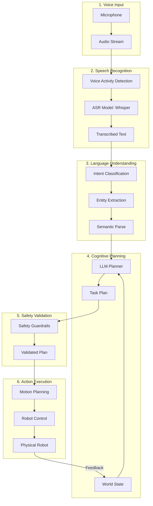
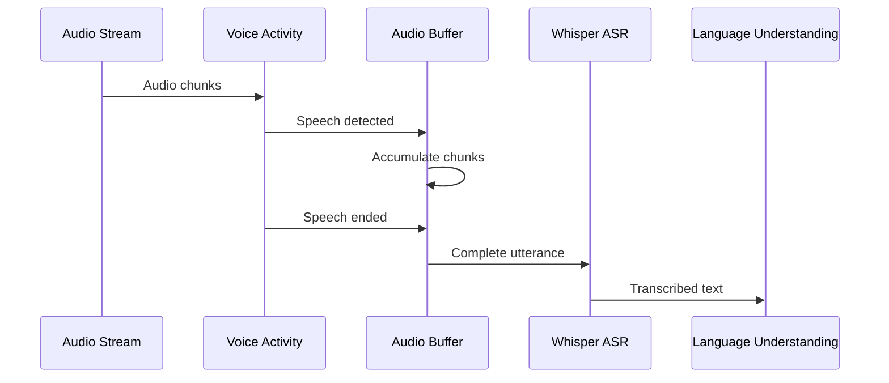
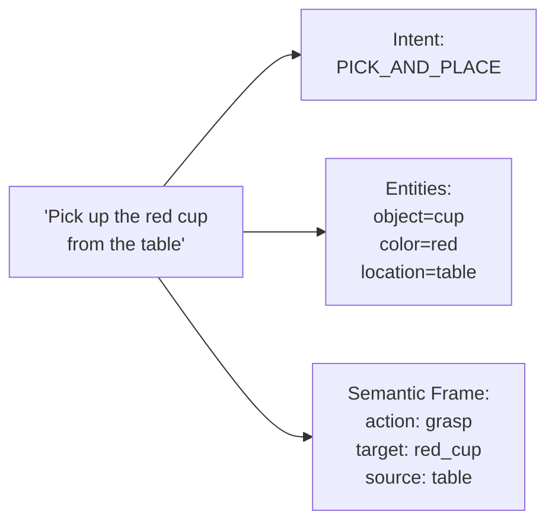
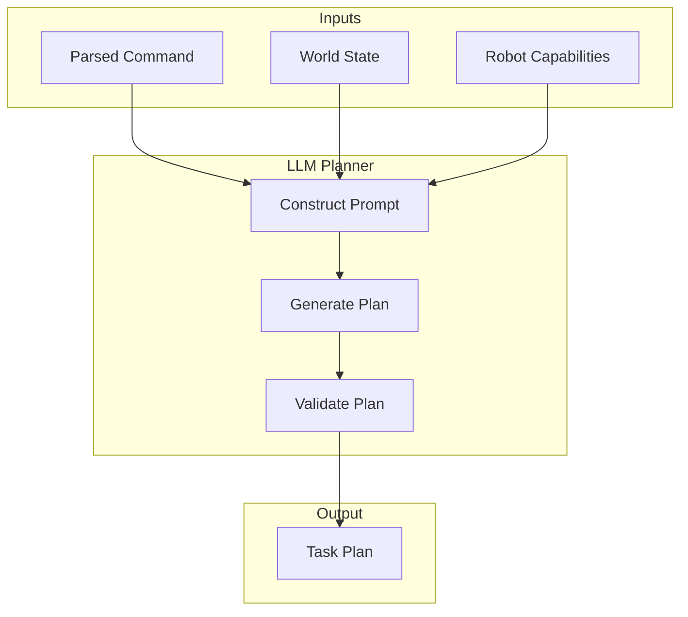
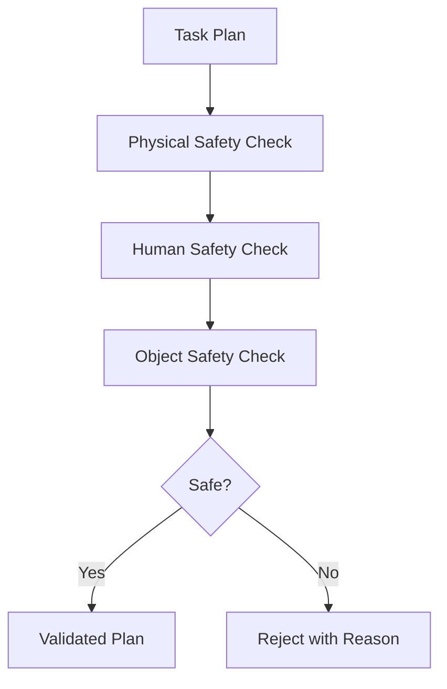
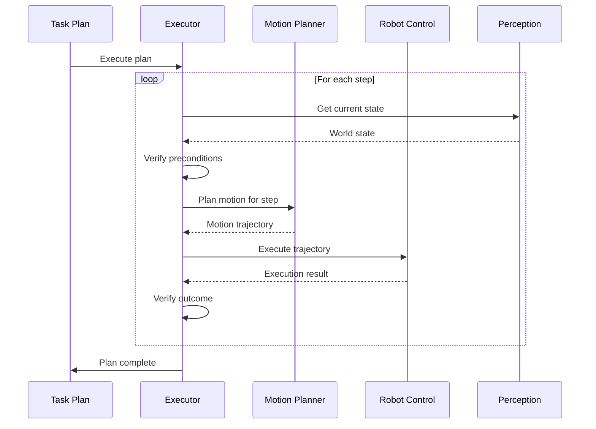

# Chapter 2: The VLA Pipeline

:::note Learning Objectives
By the end of this chapter, you will be able to:
- Trace the complete flow of data from voice input to robot action
- Identify the key stages in the VLA pipeline and their responsibilities
- Understand latency requirements at each stage of the pipeline
- Design a modular VLA architecture using ROS 2
- Recognize failure modes and error handling strategies
:::

## From Voice to Action: The Complete Journey

When a user speaks a command to a humanoid robot, a sophisticated series of transformations occurs. This chapter maps out every step of that journey, from acoustic waveforms to physical motion.



## Stage 1: Voice Input and Capture

The pipeline begins with capturing the user's voice command:

### Hardware Requirements

| Component | Specification | Purpose |
|-----------|--------------|---------|
| Microphone Array | 4+ mics, 16kHz+ sampling | Spatial audio capture |
| Audio Interface | Low-latency ADC | Digital conversion |
| Processing Buffer | 100ms chunks | Real-time processing |

### Audio Capture in ROS 2

```python
#!/usr/bin/env python3
"""
Audio capture node for VLA pipeline
Publishes audio chunks to /audio/raw topic
"""

import rclpy
from rclpy.node import Node
from std_msgs.msg import Int16MultiArray
import pyaudio
import numpy as np

class AudioCaptureNode(Node):
    def __init__(self):
        super().__init__('audio_capture_node')

        # Audio parameters
        self.sample_rate = 16000
        self.chunk_size = 1600  # 100ms at 16kHz
        self.channels = 1

        # Publisher for raw audio
        self.audio_pub = self.create_publisher(
            Int16MultiArray,
            '/audio/raw',
            10
        )

        # Initialize PyAudio
        self.audio = pyaudio.PyAudio()
        self.stream = self.audio.open(
            format=pyaudio.paInt16,
            channels=self.channels,
            rate=self.sample_rate,
            input=True,
            frames_per_buffer=self.chunk_size,
            stream_callback=self.audio_callback
        )

        self.get_logger().info('Audio capture node started')

    def audio_callback(self, in_data, frame_count, time_info, status):
        """Callback for audio stream - publishes chunks"""
        audio_data = np.frombuffer(in_data, dtype=np.int16)

        msg = Int16MultiArray()
        msg.data = audio_data.tolist()
        self.audio_pub.publish(msg)

        return (in_data, pyaudio.paContinue)

def main():
    rclpy.init()
    node = AudioCaptureNode()
    rclpy.spin(node)
    rclpy.shutdown()

if __name__ == '__main__':
    main()
```

### Voice Activity Detection (VAD)

Before processing, we detect when speech is present:

```python
class VoiceActivityDetector:
    """Detects speech segments in audio stream"""

    def __init__(self, energy_threshold=500, silence_duration=0.5):
        self.energy_threshold = energy_threshold
        self.silence_duration = silence_duration
        self.is_speaking = False
        self.silence_start = None

    def process_chunk(self, audio_chunk: np.ndarray) -> dict:
        """
        Returns: {
            'is_speech': bool,
            'energy': float,
            'speech_ended': bool  # True when speaker finishes
        }
        """
        energy = np.sqrt(np.mean(audio_chunk.astype(float) ** 2))

        if energy > self.energy_threshold:
            self.is_speaking = True
            self.silence_start = None
            return {'is_speech': True, 'energy': energy, 'speech_ended': False}
        else:
            if self.is_speaking:
                if self.silence_start is None:
                    self.silence_start = time.time()
                elif time.time() - self.silence_start > self.silence_duration:
                    self.is_speaking = False
                    return {'is_speech': False, 'energy': energy, 'speech_ended': True}
            return {'is_speech': False, 'energy': energy, 'speech_ended': False}
```

## Stage 2: Speech Recognition

The Speech Recognition stage converts audio to text:



### Whisper Integration

```python
class WhisperASRNode(Node):
    """Speech recognition using OpenAI Whisper"""

    def __init__(self):
        super().__init__('whisper_asr_node')

        # Load Whisper model
        import whisper
        self.model = whisper.load_model("base")  # Options: tiny, base, small, medium, large

        # Subscribers and publishers
        self.audio_sub = self.create_subscription(
            Int16MultiArray,
            '/audio/raw',
            self.audio_callback,
            10
        )

        self.text_pub = self.create_publisher(
            String,
            '/speech/text',
            10
        )

        # VAD and buffering
        self.vad = VoiceActivityDetector()
        self.audio_buffer = []

    def audio_callback(self, msg):
        audio_chunk = np.array(msg.data, dtype=np.int16)
        vad_result = self.vad.process_chunk(audio_chunk)

        if vad_result['is_speech']:
            self.audio_buffer.extend(audio_chunk)

        if vad_result['speech_ended'] and len(self.audio_buffer) > 0:
            self.transcribe_and_publish()

    def transcribe_and_publish(self):
        """Transcribe buffered audio and publish result"""
        # Convert to float32 for Whisper
        audio_np = np.array(self.audio_buffer, dtype=np.float32) / 32768.0

        # Transcribe
        result = self.model.transcribe(audio_np, language='en')
        text = result['text'].strip()

        if text:
            msg = String()
            msg.data = text
            self.text_pub.publish(msg)
            self.get_logger().info(f'Transcribed: "{text}"')

        # Clear buffer
        self.audio_buffer = []
```

## Stage 3: Natural Language Understanding

The NLU stage extracts meaning from transcribed text:



### Intent and Entity Extraction

```python
from dataclasses import dataclass
from typing import List, Dict, Optional

@dataclass
class ParsedCommand:
    """Structured representation of a user command"""
    raw_text: str
    intent: str
    entities: Dict[str, str]
    confidence: float
    requires_clarification: bool = False
    clarification_question: Optional[str] = None

class NaturalLanguageParser:
    """Parses natural language commands into structured representations"""

    INTENTS = {
        'PICK': ['pick up', 'grab', 'take', 'get', 'fetch'],
        'PLACE': ['put', 'place', 'set down', 'drop'],
        'NAVIGATE': ['go to', 'move to', 'navigate', 'come to'],
        'FIND': ['find', 'locate', 'search for', 'look for'],
        'INSPECT': ['show me', 'what is', 'describe', 'look at']
    }

    def parse(self, text: str) -> ParsedCommand:
        """Parse text into structured command"""
        text_lower = text.lower()

        # Detect intent
        detected_intent = self._detect_intent(text_lower)

        # Extract entities
        entities = self._extract_entities(text_lower)

        # Calculate confidence
        confidence = self._calculate_confidence(detected_intent, entities)

        # Check if clarification needed
        needs_clarification, question = self._check_clarification(
            detected_intent, entities
        )

        return ParsedCommand(
            raw_text=text,
            intent=detected_intent,
            entities=entities,
            confidence=confidence,
            requires_clarification=needs_clarification,
            clarification_question=question
        )

    def _detect_intent(self, text: str) -> str:
        for intent, patterns in self.INTENTS.items():
            for pattern in patterns:
                if pattern in text:
                    return intent
        return 'UNKNOWN'

    def _extract_entities(self, text: str) -> Dict[str, str]:
        """Extract entities like objects, colors, locations"""
        entities = {}

        # Color extraction
        colors = ['red', 'blue', 'green', 'yellow', 'black', 'white']
        for color in colors:
            if color in text:
                entities['color'] = color
                break

        # Object extraction (simplified - real system uses NER)
        objects = ['cup', 'mug', 'bottle', 'book', 'phone', 'apple', 'ball']
        for obj in objects:
            if obj in text:
                entities['object'] = obj
                break

        # Location extraction
        locations = ['table', 'desk', 'shelf', 'counter', 'floor', 'kitchen']
        for loc in locations:
            if loc in text:
                entities['location'] = loc
                break

        return entities
```

## Stage 4: Cognitive Planning with LLMs

The LLM takes the parsed command and generates an executable plan:



### Task Plan Structure

```python
@dataclass
class TaskStep:
    """A single step in the task plan"""
    step_id: int
    action_type: str  # 'navigate', 'detect', 'grasp', 'place', 'wait'
    parameters: Dict[str, Any]
    preconditions: List[str]
    expected_outcome: str
    timeout_seconds: float
    fallback_action: Optional[str] = None

@dataclass
class TaskPlan:
    """Complete plan for executing a task"""
    plan_id: str
    original_command: str
    steps: List[TaskStep]
    estimated_duration: float
    risk_level: str  # 'low', 'medium', 'high'
    requires_confirmation: bool
```

### LLM Planning Prompt Template

```python
PLANNING_PROMPT = """
You are a task planner for a humanoid robot. Given a user command and the current world state, generate a step-by-step plan.

USER COMMAND: {command}

CURRENT WORLD STATE:
- Robot location: {robot_location}
- Detected objects: {detected_objects}
- Robot arm state: {arm_state}
- Gripper state: {gripper_state}

ROBOT CAPABILITIES:
- Navigation: Can navigate to named locations
- Detection: Can detect and localize objects
- Manipulation: Can grasp objects up to 2kg
- Speech: Can speak to provide feedback

Generate a JSON plan with the following structure:
{{
    "steps": [
        {{
            "step_id": 1,
            "action_type": "navigate|detect|grasp|place|speak|wait",
            "parameters": {{}},
            "preconditions": [],
            "expected_outcome": "",
            "timeout_seconds": 30.0
        }}
    ],
    "estimated_duration": 0.0,
    "risk_level": "low|medium|high",
    "requires_confirmation": false
}}

SAFETY RULES:
1. Never plan actions that could harm humans
2. Verify object detection before grasping
3. Use appropriate grasp force for fragile objects
4. Confirm high-risk actions with user

Generate the plan:
"""
```

## Stage 5: Safety Validation

Before execution, every plan passes through safety guardrails:



### Safety Guardrail System

```python
class SafetyGuardrails:
    """Validates task plans against safety constraints"""

    def __init__(self):
        self.max_speed = 0.5  # m/s
        self.max_force = 50.0  # N
        self.forbidden_zones = []  # Areas robot cannot enter
        self.fragile_objects = ['glass', 'phone', 'laptop']

    def validate_plan(self, plan: TaskPlan, world_state: dict) -> tuple[bool, str]:
        """
        Validate a task plan against safety constraints
        Returns: (is_safe, rejection_reason)
        """
        for step in plan.steps:
            # Check each safety dimension
            safe, reason = self._check_step_safety(step, world_state)
            if not safe:
                return False, f"Step {step.step_id}: {reason}"

        return True, "Plan validated"

    def _check_step_safety(self, step: TaskStep, world_state: dict) -> tuple[bool, str]:
        """Check individual step safety"""

        # Physical safety: speed and force limits
        if step.action_type == 'navigate':
            if step.parameters.get('speed', 0) > self.max_speed:
                return False, "Navigation speed exceeds safety limit"

        # Human safety: check for humans in path
        if step.action_type in ['navigate', 'grasp']:
            if self._humans_in_path(step, world_state):
                return False, "Human detected in planned path"

        # Object safety: fragile object handling
        if step.action_type == 'grasp':
            obj = step.parameters.get('object', '')
            if any(f in obj for f in self.fragile_objects):
                if step.parameters.get('force', 0) > 10.0:
                    return False, "Excessive force for fragile object"

        return True, ""

    def _humans_in_path(self, step: TaskStep, world_state: dict) -> bool:
        """Check if humans are in the robot's planned path"""
        # Implementation would use actual sensor data
        humans = world_state.get('detected_humans', [])
        # Check collision with planned trajectory
        return False  # Simplified
```

## Stage 6: Action Execution

The final stage translates the validated plan into robot motion:



### Task Executor Implementation

```python
class TaskExecutor(Node):
    """Executes validated task plans"""

    def __init__(self):
        super().__init__('task_executor')

        # Action clients for robot capabilities
        self.nav_client = ActionClient(self, NavigateToPose, 'navigate_to_pose')
        self.grasp_client = ActionClient(self, Grasp, 'grasp_object')

        # Publishers for feedback
        self.status_pub = self.create_publisher(String, '/task/status', 10)

    async def execute_plan(self, plan: TaskPlan) -> bool:
        """Execute a complete task plan"""
        self.publish_status(f"Starting plan: {plan.original_command}")

        for step in plan.steps:
            # Verify preconditions
            if not self._verify_preconditions(step):
                self.publish_status(f"Precondition failed for step {step.step_id}")
                return False

            # Execute the step
            success = await self._execute_step(step)

            if not success:
                if step.fallback_action:
                    success = await self._execute_fallback(step)
                if not success:
                    self.publish_status(f"Step {step.step_id} failed")
                    return False

            # Verify outcome
            if not self._verify_outcome(step):
                self.publish_status(f"Outcome verification failed for step {step.step_id}")
                return False

        self.publish_status("Plan completed successfully")
        return True

    async def _execute_step(self, step: TaskStep) -> bool:
        """Execute a single step"""
        if step.action_type == 'navigate':
            return await self._execute_navigation(step)
        elif step.action_type == 'detect':
            return await self._execute_detection(step)
        elif step.action_type == 'grasp':
            return await self._execute_grasp(step)
        elif step.action_type == 'place':
            return await self._execute_place(step)
        elif step.action_type == 'speak':
            return await self._execute_speech(step)
        return False
```

## Pipeline Timing Requirements

Each stage has latency requirements for responsive interaction:

| Stage | Target Latency | Acceptable Maximum |
|-------|---------------|-------------------|
| Voice Capture | < 50ms | 100ms |
| VAD | < 10ms | 20ms |
| Speech Recognition | < 500ms | 2000ms |
| NLU Parsing | < 100ms | 200ms |
| LLM Planning | < 2000ms | 5000ms |
| Safety Validation | < 50ms | 100ms |
| Motion Planning | < 500ms | 1000ms |
| **Total Response** | **< 3-4s** | **< 8s** |

## Error Handling Throughout the Pipeline

```python
class PipelineErrorHandler:
    """Handles errors at each stage of the VLA pipeline"""

    ERROR_RESPONSES = {
        'ASR_FAILURE': "I didn't catch that. Could you please repeat?",
        'NLU_AMBIGUOUS': "I'm not sure what you mean. Did you want me to {options}?",
        'PLAN_IMPOSSIBLE': "I can't do that because {reason}.",
        'SAFETY_VIOLATION': "I can't do that safely. {reason}",
        'EXECUTION_FAILURE': "I encountered a problem: {error}. Should I try again?"
    }

    def handle_error(self, stage: str, error: Exception, context: dict) -> str:
        """Generate appropriate response for pipeline errors"""
        error_type = self._classify_error(stage, error)
        response_template = self.ERROR_RESPONSES.get(error_type, "Something went wrong.")
        return response_template.format(**context)
```

## Summary

In this chapter, you learned:

- The complete VLA pipeline consists of six stages: Voice Input, Speech Recognition, NLU, Cognitive Planning, Safety Validation, and Action Execution
- Each stage transforms data into increasingly structured representations
- ROS 2 provides the communication infrastructure connecting pipeline stages
- Latency requirements dictate design choices at each stage
- Comprehensive error handling ensures robust operation

## Key Takeaways

:::tip Remember
1. **Pipeline stages are modular** - each can be developed and tested independently
2. **VAD is essential** for efficient speech processing
3. **LLMs provide flexible planning** but require careful prompt engineering
4. **Safety validation is non-negotiable** - every plan must pass safety checks
5. **Feedback loops enable recovery** from failures at each stage
:::

## Next Steps

In the next chapter, we will dive deep into implementing speech recognition with OpenAI Whisper, including optimization techniques for real-time performance.

---

## Review Questions

1. What are the six stages of the VLA pipeline?
2. Why is Voice Activity Detection important before speech recognition?
3. What information does the NLU stage extract from transcribed text?
4. What inputs does the LLM planner need to generate a task plan?
5. What types of safety checks should be performed before execution?

## Hands-On Exercise

Design a custom message type for ROS 2 that could carry a complete `TaskPlan` between nodes. Consider:
- What fields are necessary?
- How would you represent the list of steps?
- How would you handle variable parameters for different action types?

Sketch the `.msg` file definition and explain your design choices.
