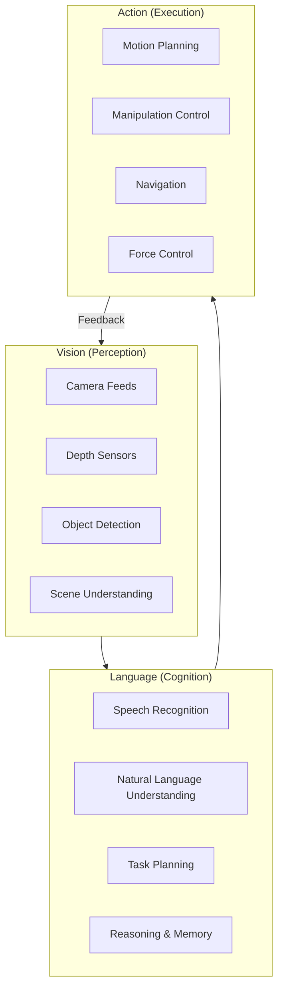
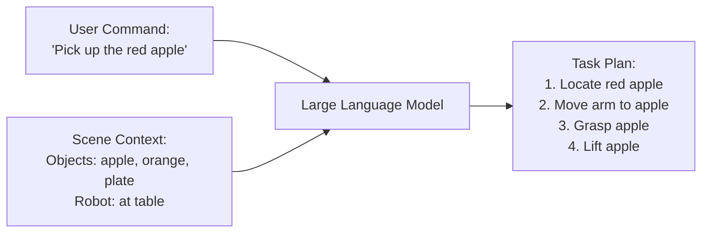
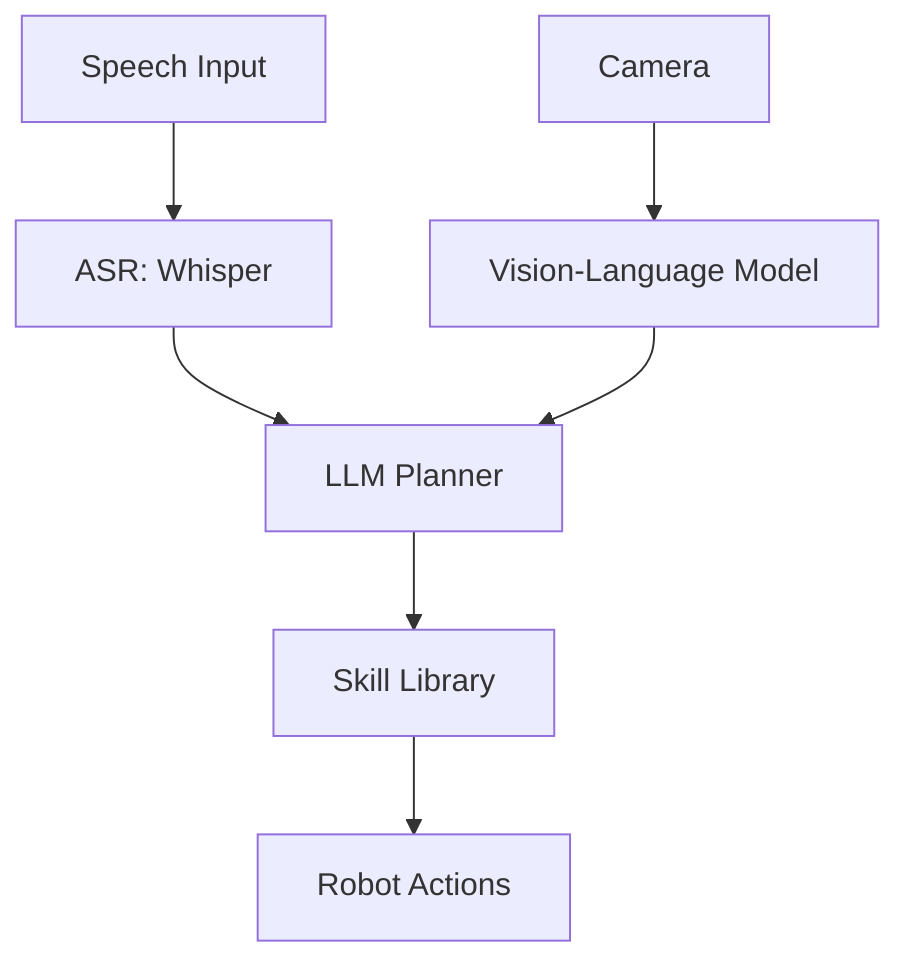
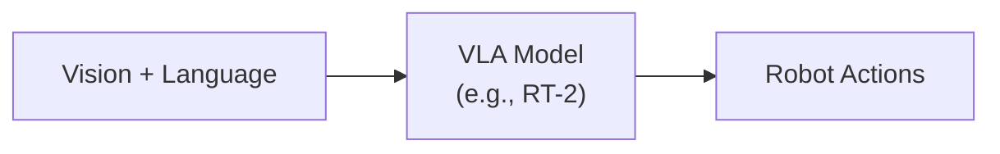
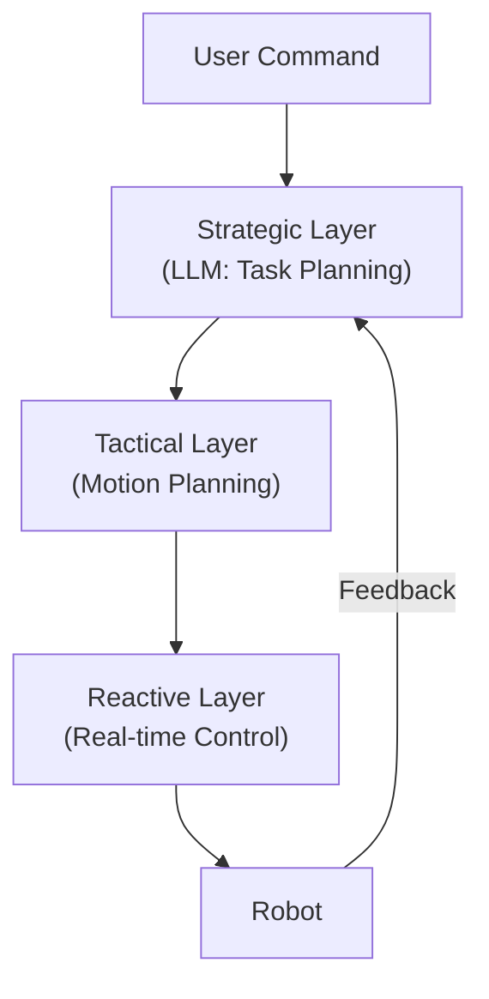

# Chapter 1: What is Vision-Language-Action (VLA)?

:::note Learning Objectives
By the end of this chapter, you will be able to:
- Define the Vision-Language-Action (VLA) paradigm and its significance in robotics
- Explain how VLA integrates perception, cognition, and action into a unified system
- Identify the key components that make up a VLA architecture
- Understand the historical evolution from classical robotics to VLA systems
- Recognize real-world applications of VLA in humanoid robotics
:::

## The Promise of Natural Human-Robot Interaction

Imagine walking up to a humanoid robot and saying, "Please go to the kitchen, find my red coffee mug, and bring it to me." Within seconds, the robot understands your words, reasons about the task, navigates to the kitchen, identifies your specific mug among other objects, grasps it carefully, and delivers it to your hands. This seamless interaction represents the culmination of decades of robotics research and the emergence of a new paradigm: **Vision-Language-Action (VLA)**.

VLA represents a fundamental shift in how we design intelligent robotic systems. Rather than programming robots with explicit rules for every possible scenario, VLA systems learn to connect what they see (Vision), what they understand from human communication (Language), and what they do in the physical world (Action).

## The Three Pillars of VLA



### Vision: The Robot's Eyes

The Vision component provides the robot with perception capabilities:

| Capability | Technology | Purpose |
|------------|------------|---------|
| **RGB Imaging** | Cameras, CNNs | Object recognition and scene understanding |
| **Depth Perception** | LiDAR, Stereo Vision | 3D spatial awareness |
| **Object Detection** | YOLO, DETR | Identifying and localizing objects |
| **Semantic Segmentation** | Mask R-CNN | Understanding scene composition |
| **Pose Estimation** | MediaPipe, OpenPose | Human and object pose detection |

### Language: The Robot's Brain

The Language component enables understanding and reasoning:

| Capability | Technology | Purpose |
|------------|------------|---------|
| **Speech Recognition** | Whisper, Google ASR | Converting speech to text |
| **Intent Parsing** | NLU Models | Understanding user goals |
| **Task Planning** | LLMs (GPT-4, Claude) | Breaking tasks into steps |
| **Knowledge Grounding** | RAG, Knowledge Graphs | Connecting to world knowledge |
| **Safety Reasoning** | Guardrail Systems | Ensuring safe operations |

### Action: The Robot's Body

The Action component translates understanding into physical motion:

| Capability | Technology | Purpose |
|------------|------------|---------|
| **Motion Planning** | MoveIt2, OMPL | Planning collision-free paths |
| **Manipulation** | Grasp Planning, IK | Object interaction |
| **Navigation** | Nav2, SLAM | Moving through environments |
| **Force Control** | Impedance Control | Gentle, adaptive manipulation |
| **Whole-Body Control** | Dynamics Solvers | Coordinated humanoid motion |

## The Evolution to VLA

### Classical Robotics (1960s-2000s)

Classical robotic systems relied on explicit programming and structured environments:

```python
# Classical approach: Explicit programming
def pick_object(robot, object_position):
    """Hard-coded pick sequence"""
    robot.move_to(object_position.x, object_position.y, object_position.z + 0.1)
    robot.move_down(0.1)
    robot.close_gripper()
    robot.move_up(0.1)
```

**Limitations:**
- Required precise object positions
- Failed with environmental variations
- No natural human interaction
- Brittle to unexpected situations

### Behavior-Based Robotics (1990s-2010s)

Reactive systems used sensor-action mappings:

```python
# Behavior-based approach: Reactive rules
class ObstacleAvoidance:
    def react(self, sensor_data):
        if sensor_data.left_obstacle:
            return Action.TURN_RIGHT
        elif sensor_data.right_obstacle:
            return Action.TURN_LEFT
        else:
            return Action.MOVE_FORWARD
```

**Improvements:**
- More robust to variations
- Real-time responsive

**Remaining Limitations:**
- No high-level reasoning
- Limited task complexity
- No language understanding

### Learning-Based Robotics (2010s-2020s)

Deep learning enabled end-to-end learning:

```python
# Learning-based approach: Neural networks
class GraspNet(nn.Module):
    def forward(self, image):
        features = self.encoder(image)
        grasp_pose = self.grasp_head(features)
        return grasp_pose
```

**Advances:**
- Learned from data rather than rules
- Generalized to new objects
- Handled visual variations

**Remaining Gaps:**
- Required massive datasets
- Limited reasoning capability
- Struggled with multi-step tasks

### VLA Era (2023-Present)

VLA systems integrate foundation models for comprehensive intelligence:

```python
# VLA approach: Integrated understanding and action
class VLAAgent:
    def __init__(self):
        self.vision = VisionEncoder()      # See the world
        self.language = LLMPlanner()       # Understand and plan
        self.action = MotionController()   # Act physically

    async def execute_command(self, speech_input, camera_feed):
        # Vision: Perceive the environment
        scene_understanding = self.vision.analyze(camera_feed)

        # Language: Understand intent and plan
        command = await self.transcribe(speech_input)
        plan = await self.language.plan_task(command, scene_understanding)

        # Action: Execute the plan
        for step in plan.steps:
            await self.action.execute(step, scene_understanding)
            scene_understanding = self.vision.analyze(camera_feed)  # Update perception
```

## Key Innovations Enabling VLA

### 1. Large Language Models (LLMs)

LLMs provide the reasoning backbone for VLA systems:



### 2. Vision-Language Models (VLMs)

VLMs bridge visual perception and language understanding:

```python
# Vision-Language Model integration
class VisionLanguageModel:
    def ground_command(self, image, command):
        """
        Given an image and command like 'pick up the red cup',
        identify which object in the image is being referred to.
        """
        objects = self.detect_objects(image)
        grounded_object = self.resolve_reference(command, objects)
        return grounded_object
```

### 3. Multimodal Foundation Models

Models like GPT-4V, Gemini, and Claude can process multiple modalities:

| Model | Vision | Language | Reasoning | Action Generation |
|-------|--------|----------|-----------|-------------------|
| GPT-4V | Yes | Yes | Yes | Via prompting |
| Gemini | Yes | Yes | Yes | Via prompting |
| RT-2 | Yes | Yes | Limited | Direct |
| PaLM-E | Yes | Yes | Yes | Via code |

## VLA Architecture Patterns

### Pattern 1: LLM as High-Level Planner



The LLM generates high-level plans that invoke pre-defined skills.

### Pattern 2: End-to-End VLA Model



A single model directly maps inputs to robot actions.

### Pattern 3: Hierarchical VLA



Multiple layers handle different time scales and abstraction levels.

## Real-World VLA Applications

### Healthcare Assistance

```python
# Hospital assistant VLA scenario
async def medication_delivery(vla_agent, patient_room, medication):
    """
    Verbal command: "Deliver medication to room 302"
    """
    # Understand: Parse room number and verify medication
    # Navigate: Plan path avoiding patients and equipment
    # Manipulate: Carefully handle medication container
    # Interact: Notify staff of delivery
    pass
```

### Warehouse Automation

```python
# Warehouse VLA scenario
async def fulfill_order(vla_agent, order_items):
    """
    Verbal command: "Pick items for order #12345"
    """
    # Understand: Parse order, identify item locations
    # Navigate: Optimal path through warehouse
    # Manipulate: Pick diverse items (fragile, heavy, etc.)
    # Verify: Confirm correct items selected
    pass
```

### Home Assistance

```python
# Home assistant VLA scenario
async def kitchen_help(vla_agent, task):
    """
    Verbal command: "Help me prepare breakfast"
    """
    # Understand: Infer breakfast preferences, available ingredients
    # Navigate: Move between refrigerator, counter, table
    # Manipulate: Handle food items, utensils safely
    # Interact: Confirm preferences, report progress
    pass
```

## The VLA Development Stack

For this module, we will build a complete VLA system using:

| Component | Technology | Chapter |
|-----------|------------|---------|
| Speech Recognition | OpenAI Whisper | Chapter 3 |
| Language Understanding | GPT-4 / Claude | Chapters 4-5 |
| Safety Guardrails | Custom + LLM | Chapter 6 |
| Object Detection | YOLO + VLMs | Chapter 7 |
| Manipulation Planning | MoveIt2 | Chapters 8, 10 |
| Navigation | Nav2 | Chapter 9 |
| Agent Loop | Custom Orchestration | Chapter 11 |
| Integration | ROS 2 Humble | Throughout |

## Summary

In this chapter, you learned:

- VLA represents the integration of Vision, Language, and Action into unified robotic systems
- The three pillars enable robots to perceive, understand, and act in the physical world
- VLA evolved from classical robotics through behavior-based and learning-based approaches
- Key innovations include LLMs, VLMs, and multimodal foundation models
- VLA has applications in healthcare, warehousing, and home assistance

## Key Takeaways

:::tip Remember
1. **VLA is a paradigm**, not a single technology - it integrates multiple AI systems
2. **Language models provide reasoning** that classical robotics lacked
3. **Vision grounds language** in the physical world
4. **Action closes the loop** by affecting the environment
5. **Feedback is essential** - perception must update continuously during action
:::

## Next Steps

In the next chapter, we will explore the complete VLA pipeline in detail, understanding how voice commands flow through the system to produce robot actions.

---

## Review Questions

1. What are the three pillars of VLA and what role does each play?
2. How does VLA differ from classical robotics approaches?
3. What role do Large Language Models play in VLA systems?
4. Why is the feedback loop from Action back to Vision important?
5. Name three real-world applications where VLA could be beneficial.

## Hands-On Exercise

Create a conceptual diagram for a VLA system that would help an elderly person with daily tasks. Consider:
- What voice commands might the user give?
- What objects would the robot need to recognize?
- What actions would the robot need to perform?
- What safety considerations are essential?

Sketch the system architecture showing the flow from user command to robot action.
