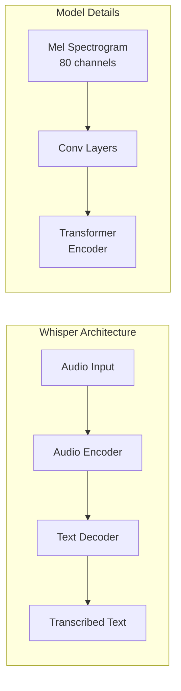

# Chapter 3: Voice Commands with OpenAI Whisper

:::note Learning Objectives
By the end of this chapter, you will be able to:
- Set up OpenAI Whisper for speech recognition in a ROS 2 environment
- Implement real-time voice activity detection and audio buffering
- Configure Whisper models for optimal latency vs accuracy tradeoffs
- Handle microphone input and audio preprocessing
- Build a complete speech recognition ROS 2 node
- Optimize Whisper for robotics applications
:::

## Introduction to Whisper

OpenAI Whisper is a state-of-the-art automatic speech recognition (ASR) system trained on 680,000 hours of multilingual and multitask supervised data. For humanoid robots, Whisper provides several key advantages:

| Feature | Benefit for Robotics |
|---------|---------------------|
| **Multilingual** | Supports 99 languages |
| **Robust** | Works in noisy environments |
| **Open Source** | No API costs, local processing |
| **Accurate** | Near human-level transcription |
| **Flexible** | Multiple model sizes available |



## Installation and Setup

### System Requirements

Before installing Whisper, ensure your system meets these requirements:

| Component | Minimum | Recommended |
|-----------|---------|-------------|
| **RAM** | 4GB | 16GB |
| **GPU** | Optional | NVIDIA CUDA-compatible |
| **Storage** | 1GB | 10GB (for all models) |
| **Python** | 3.8+ | 3.10+ |

### Installation Steps

```bash
# Create a virtual environment (recommended)
python3 -m venv vla_env
source vla_env/bin/activate

# Install PyTorch (with CUDA support if available)
pip install torch torchvision torchaudio --index-url https://download.pytorch.org/whl/cu118

# Install Whisper
pip install openai-whisper

# Install audio dependencies
pip install pyaudio sounddevice numpy

# For ROS 2 integration
pip install rclpy std_msgs
```

### Verify Installation

```python
import whisper
import torch

# Check if CUDA is available
print(f"CUDA available: {torch.cuda.is_available()}")
if torch.cuda.is_available():
    print(f"GPU: {torch.cuda.get_device_name(0)}")

# Load a model
model = whisper.load_model("base")
print(f"Model loaded successfully")

# Test transcription
result = model.transcribe("test_audio.wav")
print(f"Transcription: {result['text']}")
```

## Whisper Model Selection

Whisper offers multiple model sizes with different performance characteristics:

| Model | Parameters | VRAM | Relative Speed | English WER |
|-------|------------|------|----------------|-------------|
| `tiny` | 39M | ~1GB | ~32x | ~7.5% |
| `base` | 74M | ~1GB | ~16x | ~5.8% |
| `small` | 244M | ~2GB | ~6x | ~4.6% |
| `medium` | 769M | ~5GB | ~2x | ~4.0% |
| `large` | 1550M | ~10GB | 1x | ~3.5% |
| `large-v3` | 1550M | ~10GB | 1x | ~3.0% |

### Model Selection Strategy

```python
class WhisperModelSelector:
    """Select optimal Whisper model based on hardware and requirements"""

    @staticmethod
    def select_model(
        max_latency_ms: float = 2000,
        accuracy_priority: str = "balanced",  # "speed", "balanced", "accuracy"
        gpu_available: bool = None
    ) -> str:
        """
        Select the best model for given constraints

        Args:
            max_latency_ms: Maximum acceptable latency in milliseconds
            accuracy_priority: Priority between speed and accuracy
            gpu_available: Whether GPU is available (auto-detect if None)

        Returns:
            Model name string
        """
        import torch

        if gpu_available is None:
            gpu_available = torch.cuda.is_available()

        if accuracy_priority == "speed":
            return "tiny" if not gpu_available else "base"
        elif accuracy_priority == "accuracy":
            return "medium" if gpu_available else "small"
        else:  # balanced
            if gpu_available:
                return "small" if max_latency_ms < 1000 else "medium"
            else:
                return "tiny" if max_latency_ms < 1000 else "base"

# Usage
model_name = WhisperModelSelector.select_model(
    max_latency_ms=1500,
    accuracy_priority="balanced"
)
print(f"Selected model: {model_name}")
```

## Audio Capture and Preprocessing

### Microphone Setup

```python
import pyaudio
import numpy as np
from dataclasses import dataclass
from typing import Optional, Callable
import threading
import queue

@dataclass
class AudioConfig:
    """Audio capture configuration"""
    sample_rate: int = 16000  # Whisper expects 16kHz
    channels: int = 1
    chunk_duration_ms: int = 100
    format: int = pyaudio.paInt16

    @property
    def chunk_size(self) -> int:
        return int(self.sample_rate * self.chunk_duration_ms / 1000)


class MicrophoneCapture:
    """Handles microphone input for speech recognition"""

    def __init__(self, config: Optional[AudioConfig] = None):
        self.config = config or AudioConfig()
        self.audio = pyaudio.PyAudio()
        self.stream = None
        self.audio_queue = queue.Queue()
        self.is_running = False

    def list_devices(self) -> list:
        """List available audio input devices"""
        devices = []
        for i in range(self.audio.get_device_count()):
            info = self.audio.get_device_info_by_index(i)
            if info['maxInputChannels'] > 0:
                devices.append({
                    'index': i,
                    'name': info['name'],
                    'channels': info['maxInputChannels'],
                    'sample_rate': info['defaultSampleRate']
                })
        return devices

    def start(self, device_index: Optional[int] = None):
        """Start audio capture"""
        self.stream = self.audio.open(
            format=self.config.format,
            channels=self.config.channels,
            rate=self.config.sample_rate,
            input=True,
            input_device_index=device_index,
            frames_per_buffer=self.config.chunk_size,
            stream_callback=self._audio_callback
        )
        self.is_running = True
        self.stream.start_stream()

    def _audio_callback(self, in_data, frame_count, time_info, status):
        """Callback for audio stream"""
        audio_data = np.frombuffer(in_data, dtype=np.int16)
        self.audio_queue.put(audio_data)
        return (in_data, pyaudio.paContinue)

    def get_chunk(self, timeout: float = 1.0) -> Optional[np.ndarray]:
        """Get next audio chunk from queue"""
        try:
            return self.audio_queue.get(timeout=timeout)
        except queue.Empty:
            return None

    def stop(self):
        """Stop audio capture"""
        self.is_running = False
        if self.stream:
            self.stream.stop_stream()
            self.stream.close()
        self.audio.terminate()
```

### Voice Activity Detection (VAD)

```python
import webrtcvad
import collections

class VoiceActivityDetector:
    """
    Detects voice activity in audio stream using WebRTC VAD
    """

    def __init__(
        self,
        sample_rate: int = 16000,
        frame_duration_ms: int = 30,
        aggressiveness: int = 2,  # 0-3, higher = more aggressive filtering
        speech_pad_ms: int = 300,
        min_speech_duration_ms: int = 250
    ):
        self.sample_rate = sample_rate
        self.frame_duration_ms = frame_duration_ms
        self.frame_size = int(sample_rate * frame_duration_ms / 1000)
        self.speech_pad_ms = speech_pad_ms
        self.min_speech_duration_ms = min_speech_duration_ms

        # Initialize WebRTC VAD
        self.vad = webrtcvad.Vad(aggressiveness)

        # Ring buffer for smoothing
        num_padding_frames = int(speech_pad_ms / frame_duration_ms)
        self.ring_buffer = collections.deque(maxlen=num_padding_frames)

        # State tracking
        self.triggered = False
        self.voiced_frames = []
        self.speech_start_time = None

    def process_audio(self, audio_chunk: np.ndarray) -> dict:
        """
        Process audio chunk and detect voice activity

        Returns:
            {
                'is_speech': bool,
                'speech_segment': Optional[np.ndarray],  # Complete speech segment if ended
                'speech_duration_ms': float
            }
        """
        # Convert to bytes for WebRTC VAD
        audio_bytes = audio_chunk.astype(np.int16).tobytes()

        # Process in frames
        result = {
            'is_speech': False,
            'speech_segment': None,
            'speech_duration_ms': 0
        }

        for i in range(0, len(audio_chunk), self.frame_size):
            frame = audio_chunk[i:i + self.frame_size]
            if len(frame) < self.frame_size:
                break

            frame_bytes = frame.astype(np.int16).tobytes()
            is_speech = self.vad.is_speech(frame_bytes, self.sample_rate)

            if not self.triggered:
                self.ring_buffer.append((frame, is_speech))
                num_voiced = len([f for f, speech in self.ring_buffer if speech])

                if num_voiced > 0.9 * self.ring_buffer.maxlen:
                    self.triggered = True
                    self.speech_start_time = time.time()
                    self.voiced_frames = [f for f, _ in self.ring_buffer]
                    self.ring_buffer.clear()
                    result['is_speech'] = True
            else:
                self.voiced_frames.append(frame)
                self.ring_buffer.append((frame, is_speech))
                num_unvoiced = len([f for f, speech in self.ring_buffer if not speech])

                if num_unvoiced > 0.9 * self.ring_buffer.maxlen:
                    # Speech ended
                    self.triggered = False
                    speech_duration = (time.time() - self.speech_start_time) * 1000

                    if speech_duration >= self.min_speech_duration_ms:
                        result['speech_segment'] = np.concatenate(self.voiced_frames)
                        result['speech_duration_ms'] = speech_duration

                    self.ring_buffer.clear()
                    self.voiced_frames = []
                else:
                    result['is_speech'] = True

        return result
```

## Complete Whisper ASR Node

```python
#!/usr/bin/env python3
"""
Whisper ASR Node for ROS 2
Provides real-time speech recognition for humanoid robot voice commands
"""

import rclpy
from rclpy.node import Node
from std_msgs.msg import String
from std_srvs.srv import Trigger
import whisper
import torch
import numpy as np
import threading
import time
from typing import Optional

class WhisperASRNode(Node):
    """
    ROS 2 node for speech recognition using OpenAI Whisper

    Publishers:
        /speech/text (String): Transcribed text from speech

    Services:
        /speech/start (Trigger): Start listening
        /speech/stop (Trigger): Stop listening
    """

    def __init__(self):
        super().__init__('whisper_asr_node')

        # Declare parameters
        self.declare_parameter('model_name', 'base')
        self.declare_parameter('language', 'en')
        self.declare_parameter('device', 'auto')  # 'auto', 'cpu', 'cuda'
        self.declare_parameter('sample_rate', 16000)
        self.declare_parameter('vad_aggressiveness', 2)

        # Get parameters
        model_name = self.get_parameter('model_name').value
        self.language = self.get_parameter('language').value
        device_param = self.get_parameter('device').value
        self.sample_rate = self.get_parameter('sample_rate').value
        vad_aggressiveness = self.get_parameter('vad_aggressiveness').value

        # Determine device
        if device_param == 'auto':
            self.device = 'cuda' if torch.cuda.is_available() else 'cpu'
        else:
            self.device = device_param

        self.get_logger().info(f'Loading Whisper model "{model_name}" on {self.device}')

        # Load Whisper model
        self.model = whisper.load_model(model_name, device=self.device)
        self.get_logger().info('Whisper model loaded successfully')

        # Initialize audio capture and VAD
        self.mic = MicrophoneCapture(AudioConfig(sample_rate=self.sample_rate))
        self.vad = VoiceActivityDetector(
            sample_rate=self.sample_rate,
            aggressiveness=vad_aggressiveness
        )

        # Publishers
        self.text_pub = self.create_publisher(String, '/speech/text', 10)
        self.status_pub = self.create_publisher(String, '/speech/status', 10)

        # Services
        self.start_srv = self.create_service(
            Trigger, '/speech/start', self.start_listening_callback
        )
        self.stop_srv = self.create_service(
            Trigger, '/speech/stop', self.stop_listening_callback
        )

        # State
        self.is_listening = False
        self.processing_thread: Optional[threading.Thread] = None

        self.get_logger().info('Whisper ASR node initialized')

    def start_listening_callback(self, request, response):
        """Service callback to start listening"""
        if self.is_listening:
            response.success = False
            response.message = "Already listening"
        else:
            self.start_listening()
            response.success = True
            response.message = "Started listening"
        return response

    def stop_listening_callback(self, request, response):
        """Service callback to stop listening"""
        if not self.is_listening:
            response.success = False
            response.message = "Not currently listening"
        else:
            self.stop_listening()
            response.success = True
            response.message = "Stopped listening"
        return response

    def start_listening(self):
        """Start the speech recognition pipeline"""
        self.is_listening = True
        self.mic.start()
        self.processing_thread = threading.Thread(target=self._processing_loop)
        self.processing_thread.start()
        self.publish_status("Listening started")
        self.get_logger().info('Started listening for voice commands')

    def stop_listening(self):
        """Stop the speech recognition pipeline"""
        self.is_listening = False
        self.mic.stop()
        if self.processing_thread:
            self.processing_thread.join(timeout=2.0)
        self.publish_status("Listening stopped")
        self.get_logger().info('Stopped listening')

    def _processing_loop(self):
        """Main processing loop for audio"""
        while self.is_listening:
            # Get audio chunk
            audio_chunk = self.mic.get_chunk(timeout=0.5)
            if audio_chunk is None:
                continue

            # Process through VAD
            vad_result = self.vad.process_audio(audio_chunk)

            # If we have a complete speech segment, transcribe it
            if vad_result['speech_segment'] is not None:
                self.transcribe_and_publish(vad_result['speech_segment'])

    def transcribe_and_publish(self, audio: np.ndarray):
        """Transcribe audio segment and publish result"""
        start_time = time.time()

        # Normalize audio to float32 [-1, 1]
        audio_float = audio.astype(np.float32) / 32768.0

        # Pad or trim to 30 seconds (Whisper's expected input length)
        audio_padded = whisper.pad_or_trim(audio_float)

        # Compute mel spectrogram
        mel = whisper.log_mel_spectrogram(audio_padded).to(self.device)

        # Detect language if not specified
        if self.language == 'auto':
            _, probs = self.model.detect_language(mel)
            detected_lang = max(probs, key=probs.get)
            self.get_logger().debug(f'Detected language: {detected_lang}')
        else:
            detected_lang = self.language

        # Transcribe
        options = whisper.DecodingOptions(
            language=detected_lang,
            fp16=(self.device == 'cuda')
        )
        result = whisper.decode(self.model, mel, options)

        transcription_time = time.time() - start_time
        text = result.text.strip()

        if text:
            # Publish transcription
            msg = String()
            msg.data = text
            self.text_pub.publish(msg)

            self.get_logger().info(
                f'Transcribed ({transcription_time:.2f}s): "{text}"'
            )

    def publish_status(self, status: str):
        """Publish status message"""
        msg = String()
        msg.data = status
        self.status_pub.publish(msg)


def main(args=None):
    rclpy.init(args=args)

    node = WhisperASRNode()

    try:
        rclpy.spin(node)
    except KeyboardInterrupt:
        pass
    finally:
        node.stop_listening()
        node.destroy_node()
        rclpy.shutdown()


if __name__ == '__main__':
    main()
```

## Optimizing Whisper for Real-Time Performance

### GPU Optimization

```python
class WhisperOptimizer:
    """Optimization techniques for faster Whisper inference"""

    @staticmethod
    def enable_flash_attention(model):
        """Enable Flash Attention if available (PyTorch 2.0+)"""
        import torch
        if hasattr(torch.nn.functional, 'scaled_dot_product_attention'):
            # PyTorch 2.0+ has native flash attention
            torch.backends.cuda.enable_flash_sdp(True)
            return True
        return False

    @staticmethod
    def compile_model(model):
        """Use torch.compile for optimization (PyTorch 2.0+)"""
        import torch
        if hasattr(torch, 'compile'):
            return torch.compile(model)
        return model

    @staticmethod
    def quantize_model(model, quantization_type='int8'):
        """
        Quantize model for faster CPU inference
        Note: Requires additional libraries
        """
        try:
            import torch
            if quantization_type == 'int8':
                return torch.quantization.quantize_dynamic(
                    model, {torch.nn.Linear}, dtype=torch.qint8
                )
        except Exception as e:
            print(f"Quantization failed: {e}")
        return model
```

### Streaming Transcription

For lower latency, implement streaming transcription:

```python
class StreamingWhisperASR:
    """
    Streaming speech recognition with intermediate results
    """

    def __init__(self, model_name: str = 'base'):
        self.model = whisper.load_model(model_name)
        self.audio_buffer = []
        self.min_chunk_seconds = 1.0
        self.max_chunk_seconds = 30.0

    def process_chunk(self, audio_chunk: np.ndarray) -> Optional[str]:
        """
        Process audio chunk and return transcription when ready

        Uses a growing window approach for streaming
        """
        self.audio_buffer.extend(audio_chunk.tolist())
        buffer_duration = len(self.audio_buffer) / 16000

        if buffer_duration >= self.min_chunk_seconds:
            # Transcribe current buffer
            audio = np.array(self.audio_buffer, dtype=np.float32) / 32768.0
            result = self.model.transcribe(
                audio,
                language='en',
                without_timestamps=True,
                fp16=torch.cuda.is_available()
            )

            # Clear buffer if we have enough content
            if buffer_duration >= self.max_chunk_seconds:
                self.audio_buffer = []

            return result['text'].strip()

        return None
```

## Testing the Speech Recognition System

### Unit Tests

```python
import pytest
import numpy as np

class TestWhisperASR:
    """Test suite for Whisper ASR functionality"""

    @pytest.fixture
    def asr_model(self):
        """Load model once for all tests"""
        import whisper
        return whisper.load_model("tiny")

    def test_model_loads(self, asr_model):
        """Test that model loads correctly"""
        assert asr_model is not None

    def test_transcribe_silence(self, asr_model):
        """Test transcription of silence returns empty or minimal text"""
        silence = np.zeros(16000 * 3, dtype=np.float32)  # 3 seconds
        result = asr_model.transcribe(silence)
        assert len(result['text'].strip()) < 10  # Should be minimal

    def test_transcribe_known_audio(self, asr_model):
        """Test transcription of known audio file"""
        # Use a test audio file with known content
        result = asr_model.transcribe("test_hello.wav")
        assert "hello" in result['text'].lower()

    def test_vad_detects_speech(self):
        """Test VAD correctly identifies speech vs silence"""
        vad = VoiceActivityDetector()

        # Silence should not trigger
        silence = np.zeros(1600, dtype=np.int16)
        result = vad.process_audio(silence)
        assert not result['is_speech']

        # Loud signal should trigger (simplified test)
        noise = (np.random.randn(1600) * 10000).astype(np.int16)
        # Would need actual speech for proper test
```

## Summary

In this chapter, you learned:

- How to install and configure OpenAI Whisper for speech recognition
- Model selection strategies based on hardware and latency requirements
- Audio capture and preprocessing using PyAudio
- Voice Activity Detection for efficient speech segmentation
- Building a complete Whisper ASR node for ROS 2
- Optimization techniques for real-time performance

## Key Takeaways

:::tip Remember
1. **Choose model size based on hardware** - tiny/base for CPU, small/medium for GPU
2. **VAD is essential** for efficient processing and natural conversation
3. **16kHz sample rate** is required for Whisper
4. **GPU acceleration** dramatically improves latency
5. **Streaming approaches** enable responsive interaction
:::

## Next Steps

In the next chapter, we will explore how to parse the transcribed text into structured commands that the robot can understand and execute.

---

## Review Questions

1. What sample rate does Whisper expect for audio input?
2. How do you choose between Whisper model sizes?
3. What is the purpose of Voice Activity Detection in the pipeline?
4. How can you optimize Whisper for real-time performance?
5. What ROS 2 message type is appropriate for publishing transcriptions?

## Hands-On Exercise

Build and test the Whisper ASR node:

1. Install all required dependencies
2. Modify the node to log transcription latency
3. Test with different model sizes and compare:
   - Transcription accuracy
   - Processing latency
   - Memory usage
4. Implement a simple command filter that only publishes transcriptions containing robot-related keywords (e.g., "robot", "pick", "move", "go")

Create a ROS 2 launch file that starts the ASR node with configurable parameters.
